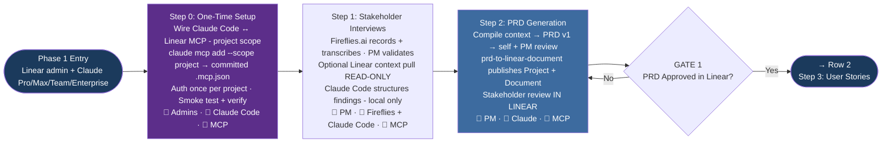
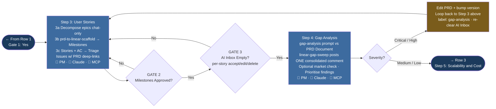
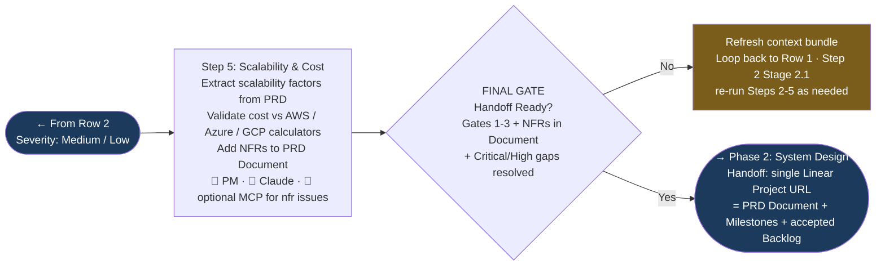

# Phase 1: Requirement Gathering — Summary Flowchart

A three-row, horizontal end-to-end view of the six per-step flowcharts in [FLOWCHART.md](./FLOWCHART.md). Each row is its own `flowchart LR` diagram so the contents render left-to-right on every Mermaid renderer (no nested-direction support needed). Read the rows in order — top to bottom — and use the "→ Row N" exit badges to follow the flow between them. The per-step diagrams remain the source of truth: open [FLOWCHART.md](./FLOWCHART.md) to drill into sub-stages, prompt names, and gate criteria.

## Legend

| Symbol | Meaning |
|--------|---------|
| 🤖 | AI-assisted step (Claude Code or Fireflies.ai) — no external write |
| 🔌 | Claude Code calling the **Linear MCP server** (read or write) |
| 👤 | Human-led step |
| Diamond | Decision point / Quality gate |
| Dark navy node | Phase entry or exit |
| Purple node | One-time setup callout (Step 0) |
| Blue node | Step containing Linear MCP write actions |
| Amber node | Cross-step loop / fallback callout |

## Row 1 — Setup and PRD

## Row 2 — User Stories and Gap Analysis

## Row 3 — Scalability and Handoff

## How to view these diagrams

The Mermaid blocks above render natively in any Mermaid-compatible viewer:

1. **GitHub / GitLab** — the blocks render inline when this Markdown file is viewed in the repo.
2. **VS Code** — with the built-in Markdown preview plus a Mermaid extension, or the Markdown Preview Mermaid Support extension.
3. **[mermaid.live](https://mermaid.live)** — paste a single `flowchart` block (without the triple backticks) to pan, zoom, and export as SVG/PNG.

## What this summary collapses

| Source diagram | Collapsed to |
|----------------|--------------|
| Step 0: One-Time Setup (project-scoped `claude mcp add` + auth + smoke test + verify) | Single node `S0` |
| Step 1: I1 → I5 (prep, record, validate, context pull, structure) | Single node `S1` |
| Step 2: 2.1 → 2.6 (compile → draft → review → publish → stakeholder review → approve) | Single node `S2` + Gate 1 |
| Step 3: 3a, 3b, 3c (epics → milestones → stories) | Single node `S3` + Gate 2 + Gate 3 |
| Step 4: G1 → G5 (gap analysis → sweep → market check → prioritise → route) | Single node `S4` + severity branch |
| Step 5: SC1 → SC2 (scalability factors → NFRs to Document) | Single node `S5` + Final Gate |

## The three human gates (recap)

1. **Gate 1 — PRD Approved (in Linear)** — PM marks Document `Approved v1.0`; Project leaves Planned.
2. **Gate 2 — Milestones Approved** — PM accepts the Milestone scaffold before stories push.
3. **Gate 3 — AI Inbox Empty** — every `ai-generated AND needs-human-review` issue accepted (or deleted). Final Gate (Step 5) re-checks all three plus scalability/cost.

See [QUALITY-GATES.md](./QUALITY-GATES.md) for full pass/fail criteria.

## Related Documents

- [Per-step Flowcharts →](./FLOWCHART.md)
- [Process Definition →](./PROCESS.md)
- [Quality Gates →](./QUALITY-GATES.md)
- [Prompt Templates →](./PROMPTS.md)
