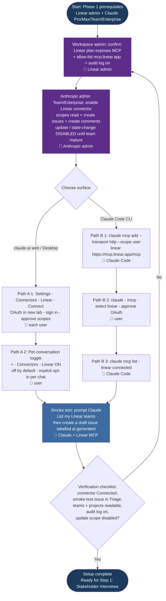
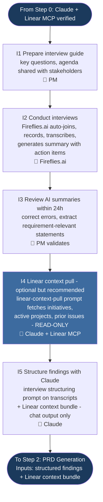
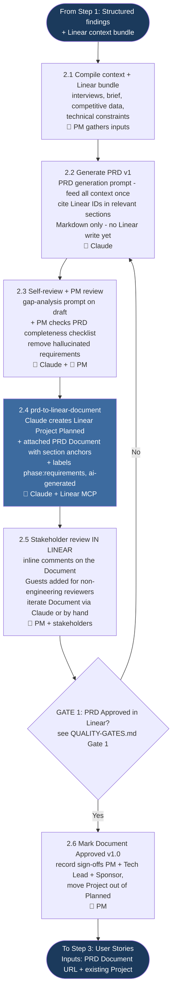
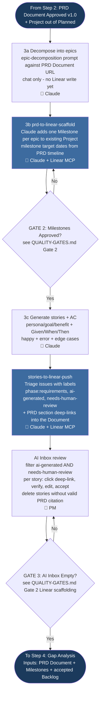
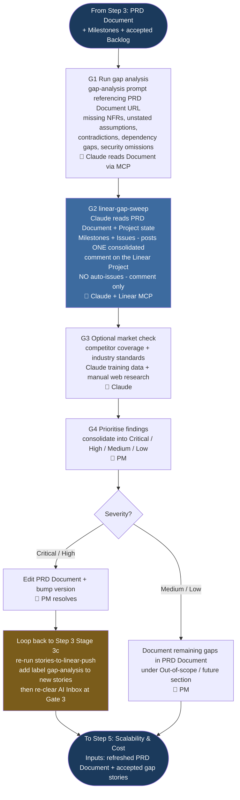
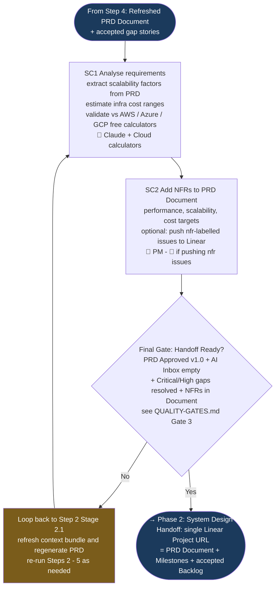

# Phase 1: Requirement Gathering — Process Flowcharts

The phase is split into six per-step flowcharts so each can be navigated, embedded in step-specific docs, or printed independently. The underlying process, sub-stages, and gate criteria live in [PROCESS.md](./PROCESS.md) and [QUALITY-GATES.md](./QUALITY-GATES.md); the diagrams here mirror that source-of-truth and chain end-to-end (each step's exit node feeds the next step's entry node).

## Table of Contents

- [Step 0: One-Time Setup](#step-0-one-time-setup)
- [Step 1: Stakeholder Interviews](#step-1-stakeholder-interviews)
- [Step 2: PRD Generation & Publish to Linear](#step-2-prd-generation--publish-to-linear)
- [Step 3: User Stories — Milestones & Issues](#step-3-user-stories--milestones--issues)
- [Step 4: Gap Analysis (Linear-diff)](#step-4-gap-analysis-linear-diff)
- [Step 5: Scalability & Cost](#step-5-scalability--cost)

## Legend

| Symbol | Meaning |
|--------|---------|
| 🤖 | AI-assisted step (Claude or Fireflies.ai) — no external write |
| 🔌 | Claude calling the **Linear MCP connector** (read or write) |
| 👤 | Human-led step |
| Diamond | Decision point / Quality gate |
| Dark navy node | Phase / step entry or exit |
| Purple node | One-time setup callout (Step 0) |
| Blue node | Linear MCP write action |
| Amber node | Cross-flowchart loop / fallback callout |

## Abbreviations

| Abbreviation | Meaning |
|--------------|---------|
| AC | Acceptance Criteria |
| AI | Artificial Intelligence |
| CLI | Command-Line Interface |
| MCP | Model Context Protocol (Anthropic open standard for tool/data connectors) |
| NFR | Non-Functional Requirement |
| OAuth | Open Authorization (delegated-access protocol) |
| PM | Product Manager |
| PRD | Product Requirements Document |

---

## Step 0: One-Time Setup

One-off connector wiring per workspace and per user. Path A covers Claude.ai web and Claude Desktop; Path B covers Claude Code (CLI / repo). Output is a verified Claude ↔ Linear MCP integration ready for Step 1's read-only context pull and Step 2's first write.

---

## Step 1: Stakeholder Interviews

Entry point is a verified Claude ↔ Linear MCP setup from Step 0. Sub-stages I1 → I5 cover interview prep, Fireflies.ai recording, AI-summary review, an optional read-only Linear context pull, and structuring findings with Claude. There is no gate at the end of Step 1 — the structured findings flow straight into Step 2's PRD context bundle. No writes to Linear in this step.

---

## Step 2: PRD Generation & Publish to Linear

Entry point is the structured findings + Linear context bundle from Step 1. Sub-stages 2.1 → 2.6 compile context, draft the PRD in Claude, self-review and PM-review the Markdown draft, publish to a Linear Project + Document via `prd-to-linear-document`, run stakeholder review inside Linear, and approve at Gate 1. On Gate 1 No, the loop returns to 2.2 to regenerate. See [QUALITY-GATES.md → Gate 1](./QUALITY-GATES.md#gate-1-prd-completeness--published-in-linear).

---

## Step 3: User Stories — Milestones & Issues

Entry point is the approved PRD Document URL + existing Linear Project from Step 2. Stage 3a decomposes epics in chat only. Stage 3b runs `prd-to-linear-scaffold` to add Milestones to the existing Project, gated by Gate 2. Stage 3c runs `stories-to-linear-push` to create Triage issues with PRD deep-links, gated per-story by Gate 3 (AI Inbox empty). On Gate 2 No, the loop returns to S3B to regenerate the scaffold; on Gate 3 No, the loop returns to per-story acceptance. See [QUALITY-GATES.md → Gate 2](./QUALITY-GATES.md#gate-2-user-story-completeness-incl-linear-scaffolding).

---

## Step 4: Gap Analysis (Linear-diff)

Entry point is the PRD Document + accepted backlog from Step 3. Stages G1 → G5 run the gap-analysis prompt against the Document, run `linear-gap-sweep` to post a consolidated comment on the Project, prioritise findings, and route them: Critical/High edit the PRD and loop back into Step 3 Stage 3c with a `gap-analysis` label; Medium/Low are documented inside the PRD Document under "Out-of-scope / future". The cross-flowchart loop is rendered as an amber callout because the actual Stage 3c push lives in Step 3's flowchart. See [QUALITY-GATES.md → Gate 3](./QUALITY-GATES.md#gate-3-final-review-phase-handoff).

---

## Step 5: Scalability & Cost

Entry point is the refreshed PRD Document from Step 4. Sub-stages SC1 → SC2 extract scalability factors with Claude, validate cost ranges against free cloud calculators (AWS / Azure / GCP), and add NFRs to the PRD Document (optionally pushing `nfr` labelled issues). The Final Gate is the Phase 1 handoff readiness check covering all of Gates 1–3 plus scalability/cost. On No, the loop returns to Step 2 Stage 2.1 to refresh inputs — rendered as an amber callout because that target sits in Step 2's flowchart. On Yes, the phase exits to Phase 2: System Design.

---

## Three Human Gates

The flow has three explicit human gates so that no Claude-authored Linear item reaches an Active state without sign-off:

1. **Gate 1 — PRD Approved (in Linear).** PM marks the Linear Document as Approved v1.0 after stakeholder review on the Document; Project leaves Planned state. Required before any Milestones or Issues are created.
2. **Gate 2 — Milestones Approved.** PM accepts the Milestone scaffold added to the existing Project before stories are pushed.
3. **Gate 3 — AI Inbox Empty.** Every `ai-generated AND needs-human-review` issue is accepted (or deleted) — clicking each PRD deep-link is part of the per-story acceptance — before phase handoff. The Final Gate (Step 5) re-checks all three plus scalability/cost completeness.

---

## Related Documents

- [Process Definition →](./PROCESS.md)
- [Quality Gates →](./QUALITY-GATES.md)
- [Prompt Templates →](./PROMPTS.md)
- [PRD Template →](../templates/prd-template.md)
- [User Story Template →](../templates/user-story-template.md)
