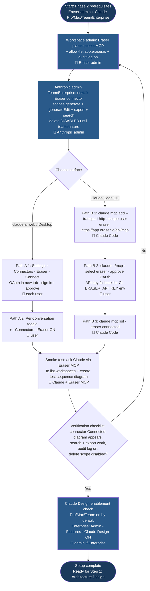
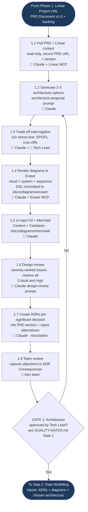
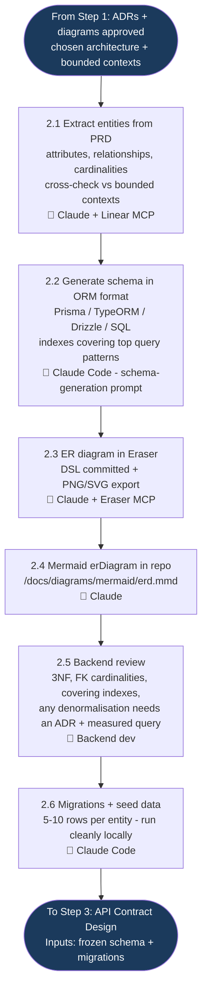
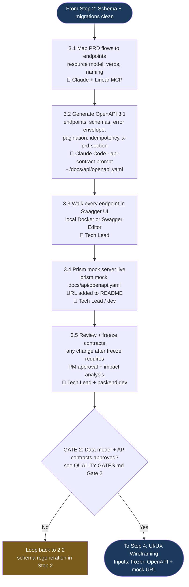
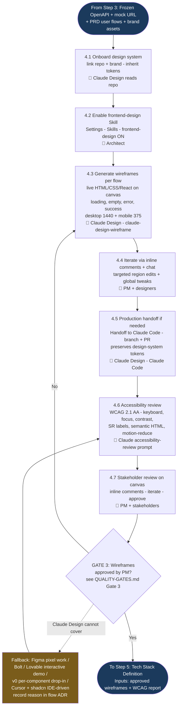
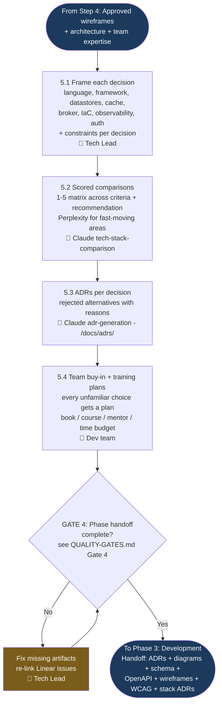

# Phase 2: System Design — Process Flowcharts

The phase is split into six per-step flowcharts so each can be navigated, embedded in step-specific docs, or printed independently. The underlying process, sub-stages, and gate criteria live in [PROCESS.md](./PROCESS.md) and [QUALITY-GATES.md](./QUALITY-GATES.md); the diagrams here mirror that source-of-truth and chain end-to-end (each step's exit node feeds the next step's entry node).

## Table of Contents

- [Step 0: One-Time Setup](#step-0-one-time-setup)
- [Step 1: Architecture Design](#step-1-architecture-design)
- [Step 2: Data Modelling](#step-2-data-modelling)
- [Step 3: API Contract Design](#step-3-api-contract-design)
- [Step 4: UI/UX Wireframing](#step-4-uiux-wireframing)
- [Step 5: Tech Stack Definition](#step-5-tech-stack-definition)

## Legend

| Symbol | Meaning |
|--------|---------|
| 🤖 | AI/tool-driven action (Claude, Claude Code, Claude Design, Eraser MCP, Linear MCP) |
| 👤 | Human-led action |
| Diamond | Decision point or quality gate |
| Dark blue node | Phase / step entry or exit |
| Mid blue node | One-time setup callout |
| Amber node | Fallback / escalation branch |

## Abbreviations

| Abbreviation | Meaning |
|--------------|---------|
| 3NF | Third Normal Form (relational schema design) |
| ADR | Architecture Decision Record |
| AC | Acceptance Criteria |
| API | Application Programming Interface |
| C4 | Context / Container / Component / Code architecture model |
| CI | Continuous Integration |
| CLI | Command-Line Interface |
| CSS | Cascading Style Sheets |
| DSL | Domain-Specific Language |
| ER / ERD | Entity-Relationship / Entity-Relationship Diagram |
| FK | Foreign Key |
| HTML | HyperText Markup Language |
| IaC | Infrastructure as Code |
| MCP | Model Context Protocol |
| NFR | Non-Functional Requirement |
| OAuth | Open Authorization |
| OpenAPI | Open API Specification (formerly Swagger) |
| ORM | Object-Relational Mapping |
| PM | Product Manager |
| PRD | Product Requirements Document |
| RPC | Remote Procedure Call |
| SPOF | Single Point of Failure |
| SR | Screen Reader |
| SVG / PNG | Scalable Vector Graphics / Portable Network Graphics |
| UI / UX | User Interface / User Experience |
| WCAG | Web Content Accessibility Guidelines |

---

## Step 0: One-Time Setup

One-off connector wiring per workspace and per user. Path A covers Claude.ai web and Claude Desktop; Path B covers Claude Code (CLI / repo). Claude Design enablement is a separate first-party check (no MCP). Output is a verified ability to drive Eraser from inside Claude and to use Claude Design surfaces in Step 4.

---

## Step 1: Architecture Design

Entry point is the Phase 1 Linear Project URL (PRD Document + backlog). Sub-stages 1.1 → 1.8 produce architecture options, Eraser + Mermaid diagrams, a design review, and ADRs. Gate 1 is Tech Lead approval; on No, the loop returns to A2 to regenerate options. See [QUALITY-GATES.md → Gate 1](./QUALITY-GATES.md#gate-1-architecture).

---

## Step 2: Data Modelling

Entry point is the approved architecture from Step 1. Sub-stages 2.1 → 2.6 extract entities, generate ORM-format schema, render ER diagrams in Eraser and Mermaid, run a backend review, and produce migrations + seeds. There is no dedicated gate at the end of Step 2 — schema and API contracts are gated together at the end of Step 3 (Gate 2). Step 2 exits straight into Step 3.

---

## Step 3: API Contract Design

Entry point is the reviewed schema from Step 2. Sub-stages 3.1 → 3.5 map flows to endpoints, generate the OpenAPI 3.1 spec, walk it in Swagger UI, stand up Prism mock servers, and review/freeze. Gate 2 covers both data model and API contracts — on No, the loop returns to D2 (schema regeneration) since gate failures most often originate in the schema. See [QUALITY-GATES.md → Gate 2](./QUALITY-GATES.md#gate-2-data-model--api-contracts).

---

## Step 4: UI/UX Wireframing

Entry point is the frozen API contract from Step 3. Sub-stages 4.1 → 4.7 onboard the design system into Claude Design, enable the frontend-design Skill, generate wireframes per flow, iterate via inline comments, optionally hand off to Claude Code, run an accessibility review, and capture stakeholder sign-off. Gate 3 is PM approval. The fallback branch (UFB → Figma / v0 / Cursor + shadcn / Bolt) covers cases Claude Design genuinely cannot meet; fallback flows still re-enter the accessibility review at U6. On Gate 3 No, the loop returns to U3 to regenerate wireframes. See [QUALITY-GATES.md → Gate 3](./QUALITY-GATES.md#gate-3-wireframes--tech-stack).

---

## Step 5: Tech Stack Definition

Entry point is the approved wireframes plus the architecture from Step 1 and team expertise profile. Sub-stages 5.1 → 5.4 frame each decision, generate scored comparisons, write ADRs, and capture team buy-in plus training plans. Gate 4 is the phase handoff readiness check — on No, fix missing artifacts and re-evaluate; on Yes, the phase exits to Phase 3: Development. See [QUALITY-GATES.md → Gate 4](./QUALITY-GATES.md#gate-4-phase-handoff).

---

## Related Documents

- [Process Definition →](./PROCESS.md)
- [Quality Gates →](./QUALITY-GATES.md)
- [Prompt Templates →](./PROMPTS.md)
- [ADR Template →](../templates/adr-template.md)
