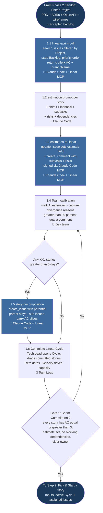
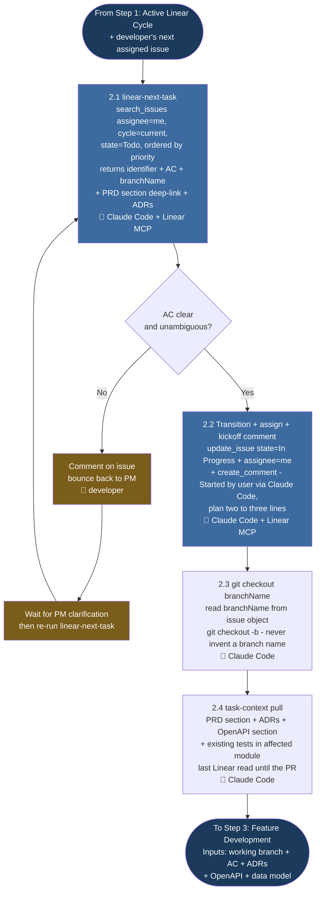
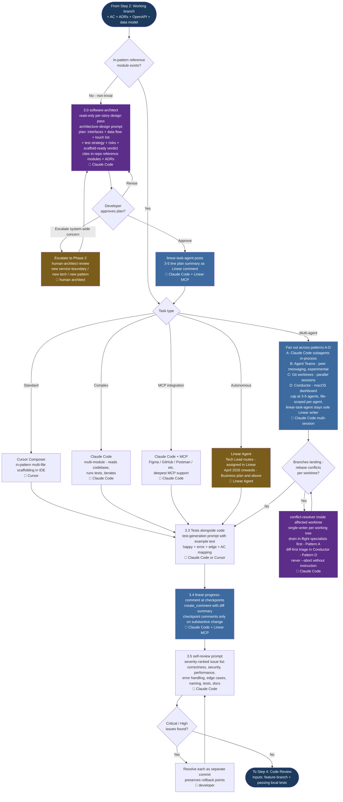
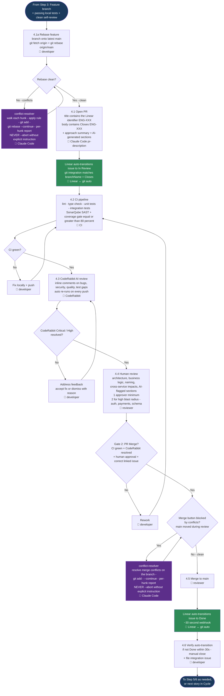
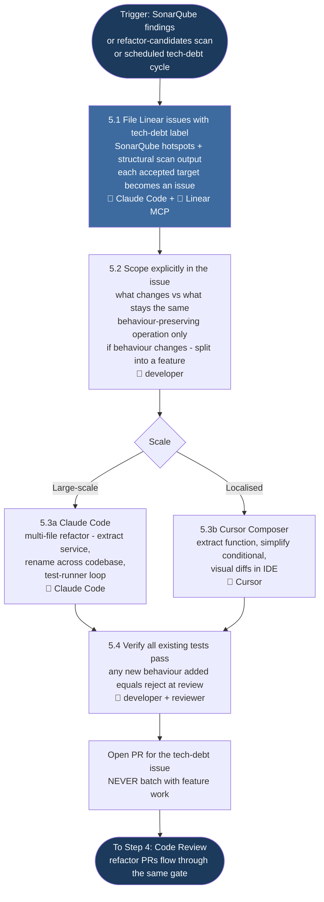
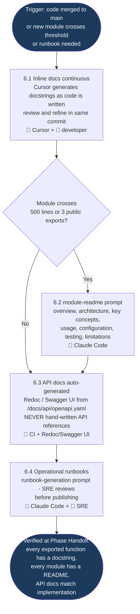

# Phase 3: Development — Process Flowcharts

The phase is split into seven per-step flowcharts so each can be navigated, embedded in step-specific docs, or printed independently. The underlying process, sub-stages, and gate criteria live in [PROCESS.md](./PROCESS.md) and [QUALITY-GATES.md](./QUALITY-GATES.md); the diagrams here mirror that source-of-truth and chain end-to-end (each step's exit node feeds the next step's entry node).

## Table of Contents

- [Step 0: One-Time Setup](#step-0-one-time-setup)
- [Step 1: Sprint Planning](#step-1-sprint-planning)
- [Step 2: Pick & Start a Story](#step-2-pick--start-a-story)
- [Step 3: Feature Development](#step-3-feature-development)
- [Step 4: Code Review](#step-4-code-review)
- [Step 5: Refactoring](#step-5-refactoring)
- [Step 6: Documentation](#step-6-documentation)
- [Daily Developer Workflow](#daily-developer-workflow)
- [Three Human Gates](#three-human-gates)

## Legend

| Symbol | Meaning |
|--------|---------|
| 🤖 | AI/tool-driven action (Cursor, Claude Code, CodeRabbit, SonarQube, Linear Agent) |
| 🔌 | Claude Code calling the **Linear MCP connector** (read or write) |
| 🔁 | Auto-transition driven by Linear's git integration (PR open / merge) |
| 👤 | Human-led action |
| Diamond | Decision point or quality gate |
| Dark navy node | Phase / step entry or exit |
| Purple node | One-time setup callout (Step 0) **or** Claude Code subagent invocation (`software-architect`, `conflict-resolver`) |
| Blue node | Linear MCP write action |
| Green node | Auto-transition driven by Linear ↔ git integration |
| Amber node | Fallback / escalation branch |

## Abbreviations

| Abbreviation | Meaning |
|--------------|---------|
| AC | Acceptance Criteria |
| ADR | Architecture Decision Record |
| AI | Artificial Intelligence |
| CI | Continuous Integration |
| CLI | Command-Line Interface |
| DoD | Definition of Done |
| ENG-XXX | Linear Engineering issue identifier (project-prefix placeholder) |
| EOD | End of Day |
| IDE | Integrated Development Environment |
| MCP | Model Context Protocol |
| OAuth | Open Authorization |
| OpenAPI | Open API Specification |
| PM | Product Manager |
| PR | Pull Request |
| PRD | Product Requirements Document |
| SAST | Static Application Security Testing |
| SRE | Site Reliability Engineer |
| WIP | Work In Progress |
| XXL | Extra-Extra-Large (story size, &gt; 5 days) |

---

## Step 0: One-Time Setup

```mermaid
flowchart TD
    S0_START([Start: Phase 3 prerequisites<br/>Linear connected from Phase 1<br/>+ Claude Code installed]) --> S0_ANTH

    S0_ANTH[Anthropic admin Team/Enterprise: widen Linear scopes<br/>enable update_issue, assign_issue,<br/>create_issue with parentId<br/>keep delete_issue DISABLED workspace-wide<br/>👤 Anthropic admin]
    S0_ANTH --> S0_PATH{Choose surface}

    S0_PATH -- Claude Code CLI primary --> S0_A1
    S0_PATH -- Cursor in-IDE optional --> S0_B1

    S0_A1[Path A 1: claude mcp add --transport http --scope user<br/>linear https://mcp.linear.app/mcp<br/>🤖 Claude Code]
    S0_A1 --> S0_A2[Path A 2: claude - /mcp - select linear - approve OAuth<br/>👤 each developer]
    S0_A2 --> S0_A3[Path A 3: verify with linear-next-task prompt<br/>response includes branchName field<br/>🤖 Claude Code + 🔌 Linear MCP]
    S0_A3 --> S0_GIT

    S0_B1[Path B 1: Cursor Settings - MCP - Add Server<br/>linear https://mcp.linear.app/mcp + OAuth<br/>👤 developer]
    S0_B1 --> S0_GIT

    S0_GIT[Linear git integration ON<br/>Settings - Integrations - GitHub/GitLab/Bitbucket<br/>auto-link PRs by branch name,<br/>auto In Review on PR open,<br/>auto Done on PR merge<br/>👤 Tech Lead]
    S0_GIT --> S0_AGENT

    S0_AGENT[Commit local subagent roster under .claude/agents/<br/>linear-task-agent for workflow orchestration<br/>+ Phase 3 specialists: software-architect, frontend-engineer,<br/>backend-engineer, code-reviewer, refactor-specialist,<br/>conflict-resolver<br/>verify with /agents and a no-write smoke test<br/>🤖 Claude Code + 👤 Tech Lead reviews]
    S0_AGENT --> S0_RECIPES

    S0_RECIPES[Adopt extensibility recipes<br/>new subagents at .claude/agents/&lt;name&gt;.md<br/>new skills at .claude/skills/&lt;name&gt;/SKILL.md<br/>shared frontmatter shape + system-prompt structure<br/>four pre-commit tests: discovery, smoke / explicit invocation,<br/>boundary / refusal, negative-routing / auto-trigger<br/>single-responsibility for agents, single-procedure for skills<br/>👤 Tech Lead walks team through the recipes]
    S0_RECIPES --> S0_VERIFY{Verification checklist:<br/>linear connected,<br/>branchName returns on smoke test,<br/>git integration ON,<br/>update_issue + assign_issue + create_issue scopes ON,<br/>delete_issue OFF,<br/>linear-task-agent + 6 Phase 3 specialists listed by /agents,<br/>linear-task-agent passes no-write smoke test,<br/>gh / git CLI available for conflict-resolver,<br/>team understands new-subagent recipe + four tests,<br/>team understands new-skill recipe + four tests,<br/>audit log on?}

    S0_VERIFY -- No --> S0_ANTH
    S0_VERIFY -- Yes --> S0_END([Setup complete<br/>Ready for Step 1: Sprint Planning])

    style S0_START fill:#1B3A5C,color:#fff
    style S0_END fill:#1B3A5C,color:#fff
    style S0_ANTH fill:#5C2E8A,color:#fff
    style S0_GIT fill:#5C2E8A,color:#fff
    style S0_AGENT fill:#5C2E8A,color:#fff
    style S0_RECIPES fill:#5C2E8A,color:#fff
    style S0_A3 fill:#3D6B9F,color:#fff
```

One-off connector wiring per developer. Path A is the primary surface — Claude Code in the terminal. Path B is optional in-IDE Linear browsing through Cursor's MCP support. After the MCP is wired and the git integration enabled, the team commits a local Claude Code subagent roster under `.claude/agents/` — `linear-task-agent` (workflow orchestration: fetch next story, transition state, branch from `branchName`, kickoff/progress comments, PR open) plus the Phase 3 role specialists (`software-architect`, `frontend-engineer`, `backend-engineer`, `code-reviewer`, `refactor-specialist`, `conflict-resolver`) that carry the role-scoped system prompts for per-story architecture design, actual implementation, pre-PR review, refactoring, and on-demand resolution of merge/rebase conflicts. The team then adopts the two **extensibility recipes** — `Creating your own Claude Code subagent` and `Creating your own Claude Code skill` — so any developer can extend the roster (new subagents at `.claude/agents/<name>.md`, new skills at `.claude/skills/<name>/SKILL.md`) following a uniform frontmatter shape, system-prompt structure, and four-test pre-commit gate (discovery, smoke / explicit invocation, boundary / refusal, negative-routing / auto-trigger). Phase 3 also widens the Anthropic Connectors policy from Phase 1's read-only baseline to permit `update_issue` (state changes), `assign_issue`, and `create_issue` with `parentId` (sub-issues). Output is a verified Claude Code ↔ Linear MCP integration with the Linear ↔ git auto-link enabled, the full subagent roster committed to the repo, and the team aligned on how to add new subagents and skills safely.

---

## Step 1: Sprint Planning

Entry point is the Phase 2 handoff: the Linear Project with PRD Document, ADRs, OpenAPI, and wireframes ready. Sub-stages 1.1 → 1.6 pull the candidate backlog from Linear via MCP, generate AI estimates, post estimates back as comments, decompose XXL stories into sub-issues using `parentId`, calibrate with the team, and commit to a Linear Cycle. **[Gate 1: Sprint Commitment](./QUALITY-GATES.md#gate-1-sprint-commitment)** closes the step — every committed story has AC ≥ 3, an estimate, no blocking dependencies, and a clear owner. On a failed gate, the loop returns to 1.4 to re-calibrate.

---

## Step 2: Pick & Start a Story

Entry point is the active Linear Cycle with stories assigned to the developer. Sub-stages 2.1 → 2.4 fetch the next assigned issue, transition it to *In Progress* with self-assign via the `me` keyword, check out the local branch from Linear's `branchName` field (so Linear's git integration auto-links on PR open), post a kickoff comment, and pull dependent context (PRD section, ADRs, OpenAPI, existing tests). There is no gate at the end of Step 2 — flow runs straight into Step 3.

---

## Step 3: Feature Development

Entry point is the working branch from Step 2. **Step 3.0** is a read-only per-story design pass via `software-architect` for non-trivial stories (cross-module touch, schema change, new endpoint surface, new external integration, no clear in-pattern reference module); in-pattern stories skip it and go directly to scaffolding. Sub-stages 3.1 → 3.5 scaffold the feature with Cursor Composer or Claude Code, write tests alongside code, post checkpoint comments to the Linear issue at substantive milestones, and self-review the diff before opening a PR. The Linear Agent fallback (LA) is an alternative entry where a Tech Lead routes a clearly scoped low-risk story directly to a Linear Agent — agent-authored output still flows through Step 4. The **Multi-agent** branch (MA) is an overlay on the standard path: the developer fans out across Claude Code subagents, an experimental Agent Team, parallel git worktrees, or [Conductor](https://www.conductor.build/) for cross-layer stories, sibling stories in flight, or adversarial review/debug — file-scoped before spawn, capped at 3–5 parallel agents, with `linear-task-agent` retaining sole Linear-write authority. When parallel branches reach merge time, `conflict-resolver` is invoked **inside each affected worktree** to resolve rebase conflicts — single-writer per working tree, never `--abort` without explicit instruction. Drain in-flight implementation specialists before spawning the resolver in the same session (Pattern A); for Conductor (Pattern D), use the dashboard's diff-first review to spot which agent's branch needs resolution vs which can be archived as redundant. Detail and decision rules live in [PROCESS.md → Multi-agent development patterns](./PROCESS.md#multi-agent-development-patterns). There is no gate at the end of Step 3 — Critical/High self-review issues must be resolved before PR open, then flow runs into Step 4.

---

## Step 4: Code Review

Entry point is the feature branch with passing local tests. Sub-stages 4.1 → 4.6 open the PR with a `[ENG-XXX]` title and `Closes ENG-XXX` body (so Linear's git integration auto-transitions), run CI (lint, types, tests, SonarQube, coverage), receive CodeRabbit AI review, complete human review (one approver minimum, two for high blast radius), merge, and verify Linear's auto-transition to Done. **Gate 2: PR Merge** is per-PR — on No, fix and re-run; on Yes, the PR merges and Linear auto-closes the issue. See [QUALITY-GATES.md → Gate 2: PR Merge](./QUALITY-GATES.md#gate-2-pr-merge).

---

## Step 5: Refactoring

Entry point is identified tech-debt: SonarQube findings or Claude Code's structural-improvement scan. Sub-stages 5.1 → 5.4 file `tech-debt`-labelled Linear issues, scope the change explicitly (what changes, what does not), execute via Claude Code (large-scale) or Cursor Composer (localised), and verify behaviour preservation through existing tests. The strict rule is enforced at PR review: refactor PRs may not introduce features. There is no dedicated gate at the end of Step 5 — refactor PRs go through Step 4 like any PR.

---

## Step 6: Documentation

Entry point is implementation code (continuous, alongside Step 3). Sub-stages 6.1 → 6.4 generate inline docs continuously in Cursor, generate module READMEs when modules cross the threshold (~500 lines or > 3 public exports), auto-generate API docs from `/docs/api/openapi.yaml` (no hand-written API references), and draft operational runbooks via Claude Code with SRE review. There is no dedicated gate — documentation is verified at Phase Handoff.

---

## Daily Developer Workflow

The Linear-driven loop runs every working day. The diagram below is a high-level view; per-step detail is in the flowcharts above.

```mermaid
flowchart TD
    DW_M([Morning]) --> DW_M1[Pull latest from main<br/>👤]
    DW_M1 --> DW_M2[linear-next-task<br/>🔌 Claude Code + Linear MCP]
    DW_M2 --> DW_M3[Review AC + ADRs + PRD section<br/>👤]
    DW_M3 --> DW_M4[update_issue In Progress + self-assign<br/>+ git checkout branchName + kickoff comment<br/>🔌 Claude Code + Linear MCP]
    DW_M4 --> DW_DESIGN{Non-trivial story?}
    DW_DESIGN -- No --> DW_C([Coding])
    DW_DESIGN -- Yes --> DW_D[software-architect → plan →<br/>developer approves →<br/>linear-task-agent posts plan summary<br/>🤖 Claude Code + 🔌 Linear MCP]
    DW_D --> DW_C

    DW_C --> DW_C1[Cursor / Claude Code implement + tests<br/>🤖]
    DW_C1 --> DW_C2[Checkpoint comments on Linear issue<br/>at substantive change<br/>🔌 Claude Code + Linear MCP]
    DW_C2 --> DW_C3[self-review prompt<br/>resolve Critical/High before PR<br/>🤖 Claude Code]
    DW_C3 --> DW_R([Review])

    DW_R --> DW_R1[Open PR ENG-XXX + Closes ENG-XXX<br/>Linear auto In Review<br/>🔁]
    DW_R1 --> DW_R2[CI - CodeRabbit - Human review<br/>🤖 + 👤]
    DW_R2 --> DW_R3[Merge - Linear auto Done<br/>🔁]
    DW_R3 --> DW_E([End of Day])

    DW_E --> DW_E1[Commit WIP to feature branch if not merged<br/>+ EOD comment on issue if blocked<br/>👤]

    style DW_M fill:#1B3A5C,color:#fff
    style DW_C fill:#1B3A5C,color:#fff
    style DW_R fill:#1B3A5C,color:#fff
    style DW_E fill:#1B3A5C,color:#fff
    style DW_D fill:#5C2E8A,color:#fff
    style DW_R1 fill:#2E8B57,color:#fff
    style DW_R3 fill:#2E8B57,color:#fff
```

---

## Three Human Gates

The flow has three explicit human gates so that no AI-generated code reaches main without sign-off:

1. **[Gate 1: Sprint Commitment](./QUALITY-GATES.md#gate-1-sprint-commitment).** Tech Lead opens the Linear Cycle with stories that have AC ≥ 3, an estimate, no blocking dependencies, and a clear owner. AI estimates inform; team velocity commits.
2. **[Gate 2: PR Merge](./QUALITY-GATES.md#gate-2-pr-merge).** Per PR — CI green, CodeRabbit Critical/High resolved, ≥ 1 human approval (2 for high-blast-radius changes — auth, payments, schema migrations), Linear identifier in title and `Closes` body match the diff.
3. **[Gate 3: Phase Completion](./QUALITY-GATES.md#gate-3-phase-completion).** Coverage ≥ 80% on new code, 0 Critical/High SonarQube on main, all stories Done, retrospective filed with AI-estimate variance recorded.

Linear's git integration handles state changes between Gate 2 and Gate 3 automatically — In Review on PR open, Done on merge — so developers never manually transition issues during normal flow.

---

## Related Documents

- [Process Definition →](./PROCESS.md)
- [Quality Gates →](./QUALITY-GATES.md)
- [Prompt Templates →](./PROMPTS.md)
- [Code Review Checklist →](../templates/code-review-checklist.md)
- [Phase 1 Linear MCP setup (Step 0) →](../01-requirement-gathering/PROCESS.md#step-0-one-time-setup--connect-claude-to-linear-via-mcp)
