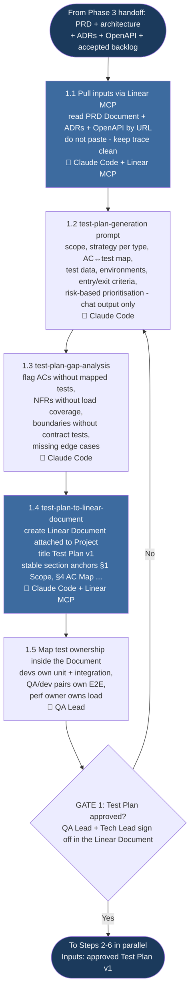
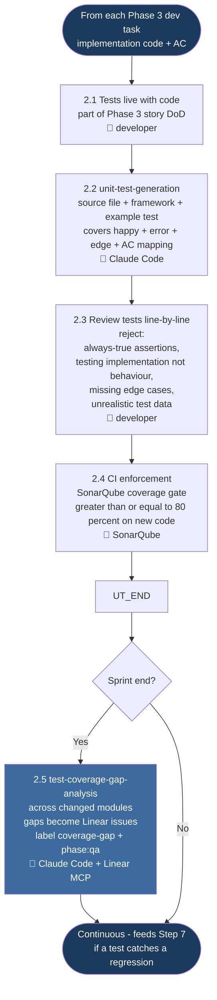
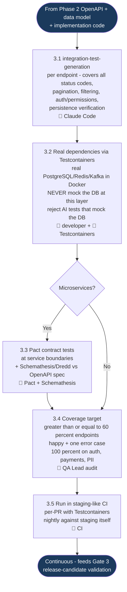
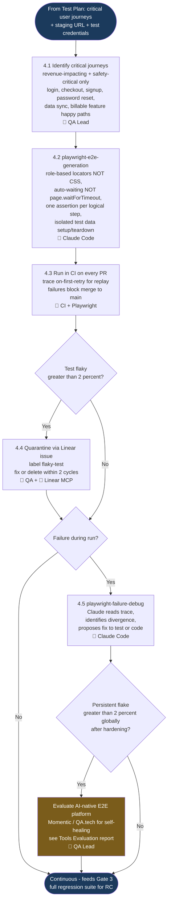
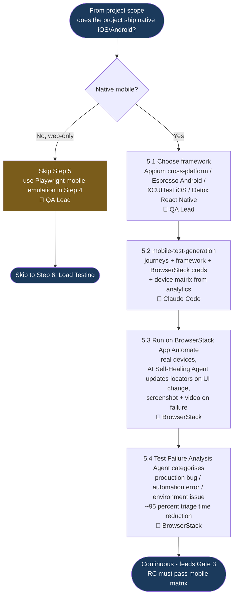
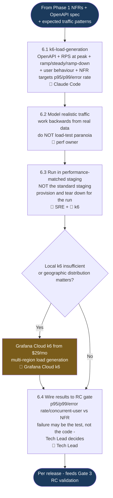
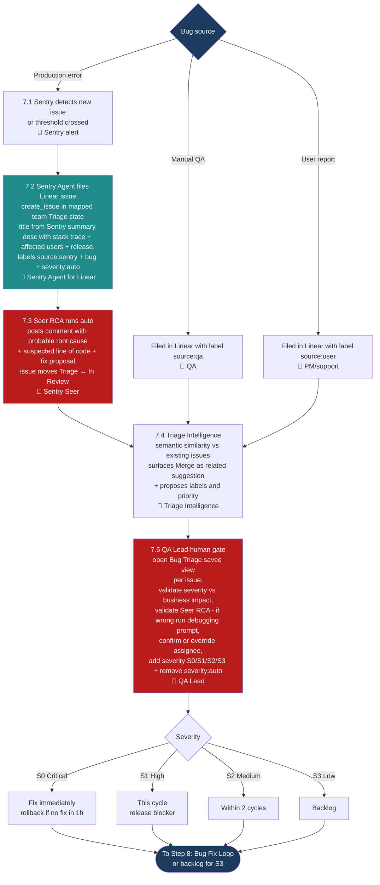

# Phase 4: Testing & QA — Process Flowcharts

The phase is split into nine per-step flowcharts so each can be navigated, embedded in step-specific docs, or printed independently. The underlying process, sub-stages, and gate criteria live in [PROCESS.md](./PROCESS.md) and [QUALITY-GATES.md](./QUALITY-GATES.md); the diagrams here mirror that source-of-truth and chain end-to-end.

## Table of Contents

- [Step 0: One-Time Setup](#step-0-one-time-setup)
- [Step 1: Test Plan Creation](#step-1-test-plan-creation)
- [Step 2: Unit Testing](#step-2-unit-testing)
- [Step 3: Integration Testing](#step-3-integration-testing)
- [Step 4: E2E Testing (Web)](#step-4-e2e-testing-web)
- [Step 5: Mobile App Testing](#step-5-mobile-app-testing)
- [Step 6: Load Testing](#step-6-load-testing)
- [Step 7: Bug Intake & Triage](#step-7-bug-intake--triage)
- [Step 8: Bug Fix Loop](#step-8-bug-fix-loop)
- [Daily QA Workflow](#daily-qa-workflow)
- [Four Human Gates](#four-human-gates)

## Legend

| Symbol | Meaning |
|--------|---------|
| 🤖 | AI/tool-driven action (Claude Code, Playwright, k6, CodeRabbit, SonarQube, BrowserStack) |
| 🔌 | Claude Code calling the **Linear MCP** or **Sentry MCP** connector (read or write) |
| 🤝 | **Sentry Agent for Linear** acting as an assignable Linear Agent |
| 🔁 | Auto-transition driven by Linear ↔ git integration (PR open / merge) |
| 👤 | Human-led action |
| Diamond | Decision point or quality gate |
| Dark navy node | Phase / step entry or exit |
| Purple node | One-time setup callout (Step 0) |
| Blue node | Linear or Sentry MCP write action |
| Teal node | Sentry Agent for Linear action |
| Green node | Auto-transition driven by Linear ↔ git integration |
| Red node | Bug-pipeline action |
| Amber node | Fallback / escalation branch |

## Abbreviations

| Abbreviation | Meaning |
|--------------|---------|
| AC | Acceptance Criteria |
| ADR | Architecture Decision Record |
| AI | Artificial Intelligence |
| CI | Continuous Integration |
| DB | Database |
| E2E | End-to-End (testing) |
| MCP | Model Context Protocol |
| NFR | Non-Functional Requirement |
| OAuth | Open Authorization |
| OpenAPI | Open API Specification |
| p95 / p99 | 95th / 99th percentile latency |
| PII | Personally Identifiable Information |
| PR | Pull Request |
| PRD | Product Requirements Document |
| QA | Quality Assurance |
| RC | Release Candidate |
| RCA | Root Cause Analysis |
| RPS | Requests Per Second |
| S0 / S1 / S2 / S3 | Severity tiers (Critical / High / Medium / Low) |
| SAST | Static Application Security Testing |
| Seer | Sentry's AI debugging / RCA agent |
| SR | Screen Reader |
| WCAG | Web Content Accessibility Guidelines |

---

## Step 0: One-Time Setup

One-off connector and integration wiring per workspace and per developer/QA. Linear MCP is already connected from Phase 1 (with Phase 3's widened scopes); Phase 4 adds (a) the Sentry MCP server for direct Sentry queries from Claude Code, and (b) the Sentry Agent for Linear, an in-app Linear Agent that auto-files production errors as triaged Linear bugs with Seer RCA pre-attached. Output is a verified end-to-end Sentry → Linear pipeline.

```mermaid
flowchart TD
    S0_START([Start: Phase 4 prerequisites<br/>Linear MCP from Phase 1 with Phase 3 scopes<br/>+ Sentry org admin<br/>+ Anthropic Connectors admin]) --> S0_ANTH

    S0_ANTH[Anthropic admin Team/Enterprise:<br/>Linear scopes - widen to allow Resolved/Done transitions<br/>and create_issue with parentId + regression-test label<br/>Sentry scopes - find_issues, get_issue, get_event,<br/>seer_status, seer_run<br/>delete_event and bulk ops DISABLED<br/>👤 Anthropic admin]
    S0_ANTH --> S0_PA

    S0_PA[Path A: Sentry MCP for Claude Code<br/>claude mcp add --transport http --scope user<br/>sentry https://mcp.sentry.dev/mcp<br/>then /mcp - select sentry - approve OAuth<br/>verify with find_issues smoke test<br/>🤖 Claude Code + 👤 each developer/QA]
    S0_PA --> S0_PB

    S0_PB[Path B: Sentry Agent for Linear<br/>Linear admin - Settings - Integrations - Sentry - Connect<br/>Sentry admin - map Sentry projects to Linear teams<br/>👤 Linear + Sentry admins]
    S0_PB --> S0_PC

    S0_PC[Sentry triage rules<br/>trigger - new issue or affects N+ users<br/>action - create Linear issue via Sentry Agent<br/>state Triage, labels source:sentry + bug + severity:auto<br/>👤 QA Lead]
    S0_PC --> S0_PD

    S0_PD[Sentry Agent settings on Linear side<br/>Auto-run Seer RCA - ON<br/>Auto-create PR - OFF<br/>Auto-update status - ON<br/>👤 QA Lead]
    S0_PD --> S0_TEST

    S0_TEST[Smoke test in non-prod project<br/>throw a deliberate error<br/>Linear Triage issue appears within 60s<br/>with stack trace + Seer RCA comment<br/>+ severity proposal + duplicate check<br/>🤝 Sentry Agent + 🤖 Seer + 🤖 Triage Intelligence]
    S0_TEST --> S0_VERIFY{Verification checklist:<br/>linear + sentry both connected,<br/>integration mapped,<br/>auto-Seer ON, auto-PR OFF,<br/>smoke-test issue created with RCA,<br/>audit logs on?}

    S0_VERIFY -- No --> S0_ANTH
    S0_VERIFY -- Yes --> S0_END([Setup complete<br/>Ready for Step 1: Test Plan Creation])

    style S0_START fill:#1B3A5C,color:#fff
    style S0_END fill:#1B3A5C,color:#fff
    style S0_ANTH fill:#5C2E8A,color:#fff
    style S0_PA fill:#5C2E8A,color:#fff
    style S0_PB fill:#5C2E8A,color:#fff
    style S0_PC fill:#5C2E8A,color:#fff
    style S0_PD fill:#5C2E8A,color:#fff
    style S0_TEST fill:#1F8B8B,color:#fff
```

---

## Step 1: Test Plan Creation

Entry point is the Phase 1 PRD Document and the Phase 2 architecture/ADRs/OpenAPI on Linear. Sub-stages 1.1 → 1.5 read inputs via Linear MCP, draft the test plan in chat, run a self-review gap-analysis, publish the plan as a Linear Document attached to the Project, and assign test ownership inside the Document. Gate 1 is QA Lead + Tech Lead approval — on No, the loop returns to 1.2 to regenerate. See [QUALITY-GATES.md → Gate 1](./QUALITY-GATES.md#gate-1-test-plan-approved).

---

## Step 2: Unit Testing

Entry point is each Phase 3 development task. Sub-stages 2.1 → 2.5 keep tests next to code (Phase 3 DoD), generate with Claude Code, review line-by-line for fake assertions, enforce coverage in CI, and audit gaps at sprint end. There is no dedicated gate at Step 2 — the per-PR coverage gate is part of Phase 3 review; Phase 4 audits at cycle close. See [QUALITY-GATES.md → Gate 2](./QUALITY-GATES.md#gate-2-per-sprint--test-coverage).

---

## Step 3: Integration Testing

Entry point is the Phase 2 OpenAPI spec, the data model, and implementation code. Sub-stages 3.1 → 3.5 generate per-endpoint integration tests, enforce real dependencies via Testcontainers (no mocked DBs), add Pact contract tests for microservices, hit the coverage target (≥ 60% endpoints, 100% on auth/payments/PII), and run in staging-like CI. There is no dedicated gate — feeds the Gate 3 release-candidate validation.

---

## Step 4: E2E Testing (Web)

Entry point is the prioritised critical user journeys from the Test Plan and a staging environment URL. Sub-stages 4.1 → 4.5 identify journeys (revenue-impacting and safety-critical only), generate Playwright tests with role-based locators and auto-waiting, run in CI on every PR, manage flakiness aggressively, and debug failures with Claude Code via the trace file. The escalation branch (E_FB) covers persistent flake > 2% by evaluating an AI-native E2E platform. No dedicated gate at Step 4 — feeds Gate 3.

---

## Step 5: Mobile App Testing

Entry point is the project's mobile applicability — skip if web-only. Sub-stages 5.1 → 5.4 generate framework-appropriate tests (Appium / Espresso / XCUITest / Detox), run on BrowserStack App Automate real devices using analytics-driven device matrix, leverage the AI Self-Healing Agent for locator drift, and route failures through the Test Failure Analysis Agent. No dedicated gate — feeds Gate 3.

---

## Step 6: Load Testing

Entry point is the NFRs from Phase 1, the OpenAPI spec, and expected traffic patterns. Sub-stages 6.1 → 6.5 generate k6 scripts with realistic traffic profiles, run in a performance-matched staging environment (not the standard staging), wire results to the release-candidate gate, and add multi-region distributed load only when local k6 cannot generate enough load. Distributed-testing escalation branches via Grafana Cloud k6.

---

## Step 7: Bug Intake & Triage

The most automated workflow in Phase 4 — the Sentry Agent for Linear handles steps 1–4 without human input; the QA Lead enters at 7.5. Sub-stages 7.1 → 7.6 cover production-error path (Sentry → Sentry Agent → Linear Triage with Seer RCA + duplicate check) and manual-bug path (QA / user reports filed directly with Triage Intelligence still running). Gate at 7.5 is the human validation step. See [QUALITY-GATES.md → Gate 2](./QUALITY-GATES.md#gate-2-per-sprint--test-coverage).

---

## Step 8: Bug Fix Loop

Entry point is a triaged bug in Linear (with Seer RCA and stack trace attached). Sub-stages 8.1 → 8.8 fetch the bug like any Phase 3 task, pull fresh Sentry context via MCP, **reproduce locally with a failing test first**, fix the code (using Seer's proposal if validated, else the debugging prompt), keep the regression test in the same PR, route through Phase 3 Step 4 review, auto-close the Linear issue and resolve the Sentry issue on merge, and post a brief post-mortem for S0/S1. The strict rule enforced at PR review: regression test ships in the same diff as the fix.

```mermaid
flowchart TD
    BF_IN([From Step 7: Triaged bug in Linear<br/>+ Seer RCA + stack trace + severity]) --> BF1

    BF1[8.1 linear-next-task on the bug<br/>same prompt as Phase 3 Step 2<br/>update_issue In Progress + assignee=me<br/>git checkout branchName<br/>🔌 Claude Code + Linear MCP] --> BF2
    BF2[8.2 sentry-context-pull<br/>fetch latest event + stack trace<br/>+ affected-user list + breadcrumbs<br/>+ release version that introduced it<br/>🔌 Claude Code + Sentry MCP] --> BF3

    BF3[8.3 bug-reproduction<br/>Claude proposes a failing test<br/>that captures the bug<br/>WRITE THIS TEST FIRST<br/>🤖 Claude Code] --> BF4

    BF4{Seer RCA validated<br/>at Step 7.5?}
    BF4 -- Yes --> BF4A[8.4a Apply Seer's fix<br/>👤 developer + 🤖 Claude Code]
    BF4 -- No --> BF4B[8.4b debugging prompt<br/>read code paths, trace data flow,<br/>propose targeted fix<br/>🤖 Claude Code]
    BF4A --> BF5
    BF4B --> BF5

    BF5[8.5 Add regression test<br/>the failing test from 8.3 now passes - keep it<br/>SAME DIFF as the fix - reviewers reject otherwise<br/>👤 developer] --> BF6
    BF6[8.6 Open PR through Phase 3 Step 4<br/>title - ENG-XXX Fix bug summary<br/>body - Closes ENG-XXX + brief post-mortem<br/>🤖 Claude Code pr-description] --> BF_AUTO1

    BF_AUTO1[Linear auto - In Review<br/>🔁 Linear ↔ git auto] --> BF_REVIEW[Phase 3 Step 4 review gate<br/>CI + CodeRabbit + human]
    BF_REVIEW --> BF_AUTO2[On merge - Linear auto - Done<br/>🔁]
    BF_AUTO2 --> BF7

    BF7[8.7 Sentry issue resolved<br/>update_issue resolved in version release<br/>QA verifies in staging,<br/>posts Verified comment on Linear issue<br/>🔌 Claude Code + Sentry MCP + 👤 QA] --> BF8

    BF8{Severity S0 or S1?}
    BF8 -- Yes --> BF8A[8.8 post-mortem comment on Linear<br/>root cause one paragraph,<br/>why tests missed it,<br/>regression + monitoring to add,<br/>prevention owner<br/>🤖 Claude Code post-mortem prompt + 👤]
    BF8A --> BF_OUT
    BF8 -- No --> BF_OUT([To next bug or back to Step 7<br/>or to Gate 3 RC validation])

    style BF_IN fill:#1B3A5C,color:#fff
    style BF_OUT fill:#1B3A5C,color:#fff
    style BF1 fill:#3D6B9F,color:#fff
    style BF2 fill:#3D6B9F,color:#fff
    style BF7 fill:#3D6B9F,color:#fff
    style BF_AUTO1 fill:#2E8B57,color:#fff
    style BF_AUTO2 fill:#2E8B57,color:#fff
    style BF5 fill:#B91C1C,color:#fff
    style BF8A fill:#B91C1C,color:#fff
```

---

## Daily QA Workflow

The daily loop runs in parallel with development. Production-error intake is event-driven via Sentry; manual testing and CI failures feed the same triage queue.

```mermaid
flowchart TD
    QA_M([Morning]) --> QA_M1[Check CI status<br/>any test failures overnight?<br/>👤]
    QA_M1 --> QA_M2[Open Sentry — any new prod errors?<br/>cross-check Bug Triage view in Linear<br/>👤]
    QA_M2 --> QA_M3[Clear the Bug Triage saved view<br/>validate severity + assignee for each<br/>👤 QA Lead]
    QA_M3 --> QA_PER([Per Story - parallel with dev])

    QA_PER --> QA_P1[Unit tests with Claude Code<br/>alongside the code<br/>🤖]
    QA_P1 --> QA_P2[Integration tests for new endpoints<br/>real DB via Testcontainers<br/>🤖]
    QA_P2 --> QA_P3[Playwright E2E for new critical flows<br/>🤖]
    QA_P3 --> QA_P4[PR includes prod code + tests + regressions<br/>👤]
    QA_P4 --> QA_W([Weekly])

    QA_W --> QA_W1[Run full regression suite<br/>automated nightly<br/>🤖]
    QA_W1 --> QA_W2[Review flakiness report<br/>fix or quarantine via flaky-test label<br/>🔌 Linear MCP + 👤]
    QA_W2 --> QA_W3[Load test latest build vs staging<br/>🤖 k6]
    QA_W3 --> QA_REL([Per Release])

    QA_REL --> QA_R1[All Gate 3 checks pass before RC<br/>👤 Tech Lead + QA Lead]
    QA_R1 --> QA_R2[Archive load test + coverage report<br/>👤]

    style QA_M fill:#1B3A5C,color:#fff
    style QA_PER fill:#1B3A5C,color:#fff
    style QA_W fill:#1B3A5C,color:#fff
    style QA_REL fill:#1B3A5C,color:#fff
```

---

## Four Human Gates

The flow has four explicit human gates so that no AI-triaged bug or AI-generated test reaches main without sign-off:

1. **Gate 1 — Test Plan approved.** QA Lead + Tech Lead sign off in the Linear Document. Required before any test code is written. See [QUALITY-GATES.md → Gate 1](./QUALITY-GATES.md#gate-1-test-plan-approved).
2. **Gate 2 — Per-PR + per-cycle test coverage.** New code has unit tests; coverage ≥ 80%; integration tests for new endpoints; E2E tests for new critical flows; flakiness < 2%. Enforced continuously through Phase 3 Step 4. See [QUALITY-GATES.md → Gate 2](./QUALITY-GATES.md#gate-2-per-sprint--test-coverage).
3. **Gate 3 — Release candidate validation.** All test types green, load tests meet NFRs, 0 S0 / 0 S1 open, regression suite green, flake < 2%. Tech Lead + QA Lead approve. See [QUALITY-GATES.md → Gate 3](./QUALITY-GATES.md#gate-3-release-candidate-testing).
4. **Gate 4 — Phase Handoff.** All artefacts present and Linear-linked, end-to-end Sentry-Linear pipeline verified on a real bug this cycle, post-mortems filed for every S0/S1. See [QUALITY-GATES.md → Gate 4](./QUALITY-GATES.md#gate-4-phase-handoff).

The Sentry Agent for Linear and Linear's git integration handle all auto-transitions; humans validate, prioritise, and review — they do not transcribe.

---

## Related Documents

- [Process Definition →](./PROCESS.md)
- [Quality Gates →](./QUALITY-GATES.md)
- [Prompt Templates →](./PROMPTS.md)
- [Test Plan Template →](../templates/test-plan-template.md)
- [Bug Report Template →](../templates/bug-report-template.md)
- [Phase 1 Linear MCP setup (Step 0) →](../01-requirement-gathering/PROCESS.md#step-0-one-time-setup--connect-claude-to-linear-via-mcp)
- [Phase 3 Development PROCESS →](../03-development/PROCESS.md)
