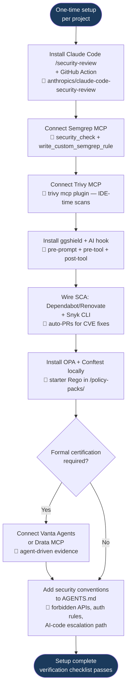
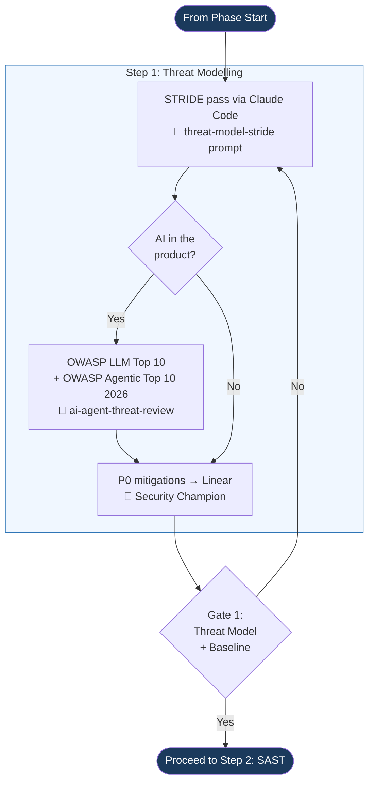
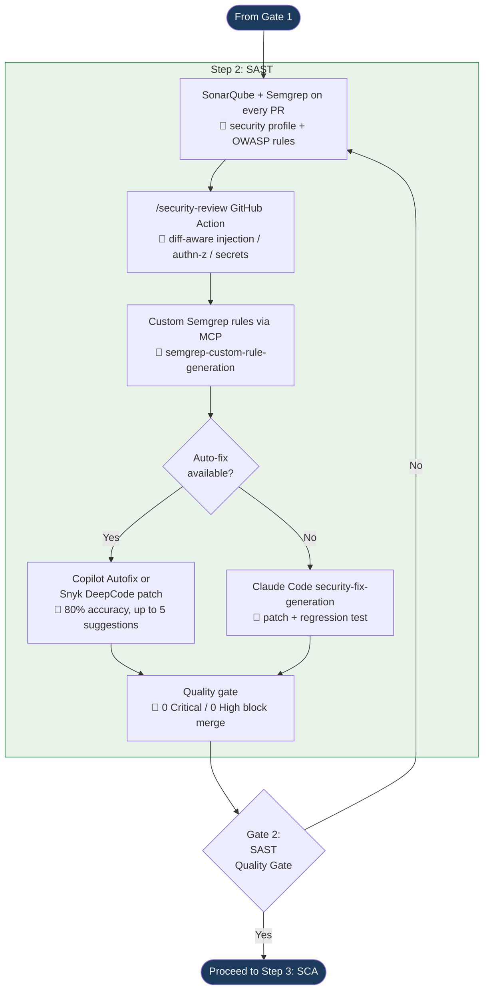
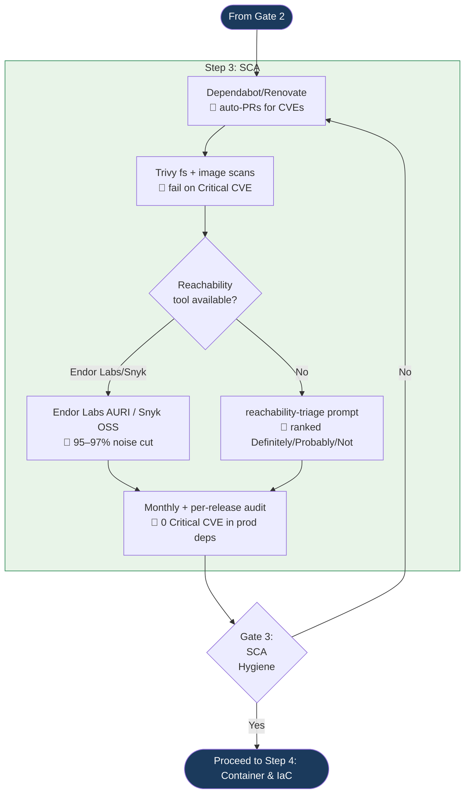
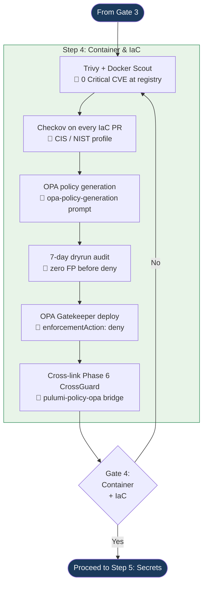
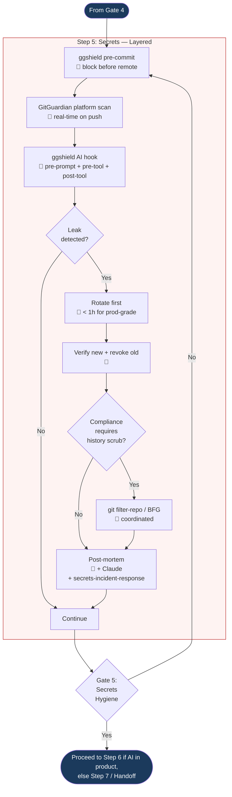
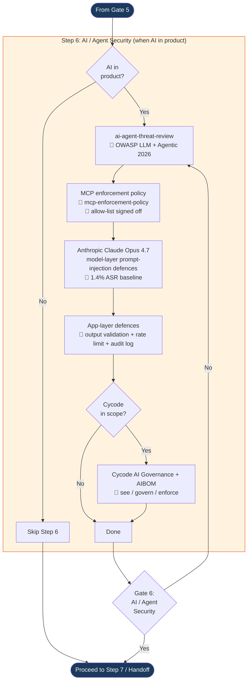
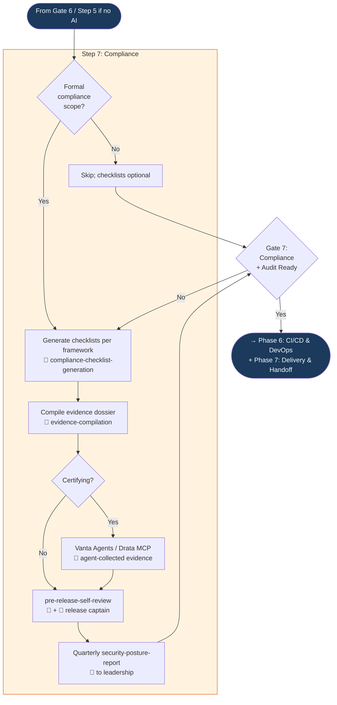

# Phase 5: Security & Compliance — Process Flowchart

This flowchart visualises the [Phase 5 PROCESS](./PROCESS.md). The phase flow is now split into a **high-level overview** plus **seven per-step detail diagrams** (Step 1 Threat Modelling → Step 7 Compliance), with a separate Step 0 one-time setup diagram. Gates 1–7 link adjacent step detail diagrams; the overview shows the cross-step routing (AI-in-product bypass around Step 6, compliance-scope bypass around Step 7). Each detail diagram terminates at its gate, and a "No" gate result loops back to the start of the same step. Gate definitions live in [QUALITY-GATES.md](./QUALITY-GATES.md). The 🤖 / 👤 markers show which actions are AI-driven and which require a human decision.

## Abbreviations

| Abbreviation | Meaning |
|--------------|---------|
| AIBOM | AI Bill of Materials |
| ASR | Attack Success Rate (prompt-injection benchmark) |
| AURI | Application Usage Reachability Index (Endor Labs) |
| BFG | BFG Repo-Cleaner (git history rewriter) |
| CIS | Center for Internet Security |
| CVE | Common Vulnerabilities and Exposures |
| FP | False Positive |
| GHAS | GitHub Advanced Security |
| HIPAA | Health Insurance Portability and Accountability Act |
| IaC | Infrastructure as Code |
| ISO | International Organization for Standardization |
| LLM | Large Language Model |
| MCP | Model Context Protocol |
| NIST | National Institute of Standards and Technology |
| NIST AI RMF | NIST AI Risk Management Framework |
| OPA | Open Policy Agent |
| OSS | Open Source Software |
| OWASP | Open Worldwide Application Security Project |
| PR | Pull Request |
| RCA | Root Cause Analysis |
| Rego | OPA's policy-definition language |
| SAST | Static Application Security Testing |
| SCA | Software Composition Analysis |
| SOC 2 | Service Organization Control 2 (audit framework) |
| STRIDE | Spoofing, Tampering, Repudiation, Information disclosure, DoS, Elevation of privilege |

---

## Step 0: One-Time Setup



---

## End-to-End Phase Flow — Overview

High-level flow across all seven steps. Each step box below maps to a per-step **Detail** diagram further down this page. Gate 1–7 names match [QUALITY-GATES.md](./QUALITY-GATES.md); a "No" at any gate loops back to the start of that step (shown in the detail diagrams).

```mermaid
flowchart TD
    START([Phase 5: Security & Compliance<br/>Continuous from project start]) --> S1

    S1[Step 1: Threat Modelling]
    S2[Step 2: SAST]
    S3[Step 3: SCA]
    S4[Step 4: Container & IaC]
    S5["Step 5: Secrets — Layered"]
    S6["Step 6: AI / Agent Security (when AI in product)"]
    S7[Step 7: Compliance]

    S1 --> GATE1{Gate 1:<br/>Threat Model<br/>+ Baseline}
    GATE1 -- No --> S1
    GATE1 -- Yes --> S2

    S2 --> GATE2{Gate 2:<br/>SAST<br/>Quality Gate}
    GATE2 -- No --> S2
    GATE2 -- Yes --> S3

    S3 --> GATE3{Gate 3:<br/>SCA<br/>Hygiene}
    GATE3 -- No --> S3
    GATE3 -- Yes --> S4

    S4 --> GATE4{Gate 4:<br/>Container<br/>+ IaC}
    GATE4 -- No --> S4
    GATE4 -- Yes --> S5

    S5 --> GATE5{Gate 5:<br/>Secrets<br/>Hygiene}
    GATE5 -- No --> S5
    GATE5 -- Yes --> AI_IN_PROD

    AI_IN_PROD{AI in<br/>product?}
    AI_IN_PROD -- Yes --> S6
    AI_IN_PROD -- No --> COMP_SCOPE

    S6 --> GATE6{Gate 6:<br/>AI / Agent<br/>Security}
    GATE6 -- No --> S6
    GATE6 -- Yes --> COMP_SCOPE

    COMP_SCOPE{Formal<br/>compliance<br/>scope?}
    COMP_SCOPE -- Yes --> S7
    COMP_SCOPE -- No --> HANDOFF

    S7 --> GATE7{Gate 7:<br/>Compliance<br/>+ Audit Ready}
    GATE7 -- No --> S7
    GATE7 -- Yes --> HANDOFF

    HANDOFF([→ Phase 6: CI/CD & DevOps<br/>+ Phase 7: Delivery & Handoff])

    click S1 "#step-1-threat-modelling--detail"
    click S2 "#step-2-sast--detail"
    click S3 "#step-3-sca--detail"
    click S4 "#step-4-container--iac--detail"
    click S5 "#step-5-secrets--layered--detail"
    click S6 "#step-6-ai--agent-security--detail"
    click S7 "#step-7-compliance--detail"

    style START fill:#1B3A5C,color:#fff
    style HANDOFF fill:#1B3A5C,color:#fff
    style S1 fill:#f0f7ff,stroke:#2E75B6
    style S2 fill:#e8f4e8,stroke:#2E8B57
    style S3 fill:#e8f4e8,stroke:#2E8B57
    style S4 fill:#e8f4e8,stroke:#2E8B57
    style S5 fill:#fef3f2,stroke:#B91C1C
    style S6 fill:#fff3e0,stroke:#E65100
    style S7 fill:#fff3e0,stroke:#E65100
```



---

## Step 1: Threat Modelling — Detail



---

## Step 2: SAST — Detail



---

## Step 3: SCA — Detail



---

## Step 4: Container & IaC — Detail



---

## Step 5: Secrets — Layered — Detail



---

## Step 6: AI / Agent Security — Detail



---

## Step 7: Compliance — Detail



---

## Step-by-Step Anchors

The PROCESS.md links into these sections by anchor — keep the headings stable.

### Step 1: Threat Modelling
STRIDE + (if AI is in product) OWASP LLM Top 10 + OWASP Top 10 for Agentic Applications 2026 — outputs `/docs/security/threat-model.md` and P0 Linear tickets. See [PROCESS.md → Step 1](./PROCESS.md#step-1-threat-modelling--security-architecture-review).

### Step 2: SAST
SonarQube CE + Semgrep MCP + Claude Code `/security-review` (diff-aware) + GitHub Copilot Autofix; Snyk DeepCode AI as paid auto-fix upgrade; Aikido Infinite as alt all-in-one. See [PROCESS.md → Step 2](./PROCESS.md#step-2-sast--continuous-ai-assisted-static-analysis).

### Step 3: SCA
Dependabot/Renovate + Trivy + reachability-aware tools (Endor Labs AURI / Snyk Open Source) for 95–97% noise reduction; Pulumi Insights cross-link from Phase 6. See [PROCESS.md → Step 3](./PROCESS.md#step-3-sca--reachability-aware-dependency-audit).

### Step 4: Container & IaC
Trivy MCP + Docker Scout + Checkov + OPA Gatekeeper with AI policy generation (Red Hat 2026 dynamic generator pattern); mandatory dryrun-first. See [PROCESS.md → Step 4](./PROCESS.md#step-4-container--iac-security).

### Step 5: Secrets
ggshield pre-commit + GitGuardian platform + ggshield AI hook (pre-prompt + pre-tool-use + post-tool-use) for Cursor / Claude Code / Copilot. See [PROCESS.md → Step 5](./PROCESS.md#step-5-secrets--layered-defence-with-ai-hooks).

### Step 6: AI Agent Security
OWASP LLM Top 10 + OWASP Top 10 for Agentic Applications 2026; Anthropic Claude Opus 4.7 model-layer defences; MCP enforcement allow-list; Cycode AI Governance + AIBOM (optional). See [PROCESS.md → Step 6](./PROCESS.md#step-6-ai--agent-specific-security).

### Step 7: Compliance
Claude for checklists + evidence; Trivy/Checkov/OPA for technical controls; Vanta Agents or Drata MCP when certifying SOC 2 / ISO 27001 / HIPAA; NIST AI RMF + ISO/IEC 42001 if AI is in the product. See [PROCESS.md → Step 7](./PROCESS.md#step-7-compliance--ai-generated-checklists-evidence-and-audit).

---

## Key Decision Points

1. **AI in the product?** — Drives whether Steps 1.2 + 6 are mandatory or skipped. If yes, the OWASP LLM Top 10 + OWASP Agentic Top 10 are required; ASI01 Agent Goal Hijacking is the top risk in 2026.
2. **Reachability tool available?** — Endor Labs AURI / Snyk Open Source give 95–97% noise reduction natively; if not budgeted, the `reachability-triage` Claude Code prompt is the fallback.
3. **Auto-fix path?** — Copilot Autofix is free with GHAS Code Security and the default; Snyk DeepCode AI / Snyk Agent Fix is the paid upgrade with 80% accuracy and up to 5 suggestions per finding.
4. **AI-generated OPA policy?** — Must spend at least 7 days in `enforcementAction: dryrun` with zero false positives before flipping to `deny`. Skipping dryrun is how a single-line policy locks every deploy.
5. **Compliance certification scope?** — Drives whether Vanta Agents / Drata MCP / Secureframe is in scope. For internal projects without certification, Claude-generated checklists + the Phase-5 evidence pipeline are sufficient.
6. **History scrub on secret leak?** — Only if compliance requires immutable record. **Rotation is the primary mitigation; history scrubbing is cosmetic.**

---

## The Developer Experience

```
Developer's day:
  PR opened → CI runs (SonarQube + Semgrep + /security-review + Trivy + Checkov + ggshield) →
  Copilot Autofix or Snyk DeepCode posts patch suggestions →
  Critical/High findings block merge until resolved →
  Custom Semgrep rule for any project-specific pattern →
  Human approval; merge

Per release:
  pre-release-self-review prompt before clicking prod-deploy →
  All seven gates green (Gate 6 only if AI in product, Gate 7 only if certifying) →
  Deploy

Quarterly:
  security-posture-report to leadership →
  Secret rotation drill →
  Vanta / Drata 100%-coverage check (if certifying) →
  AGENTS.md security conventions reviewed and updated

Incident (secret leak / vuln disclosed):
  ggshield AI hook OR GitGuardian fires →
  secrets-incident-response prompt for the runbook →
  Rotate first (< 1h prod-grade), scrub second (only if compliance requires) →
  Post-mortem within 48h; process change to prevent recurrence
```
