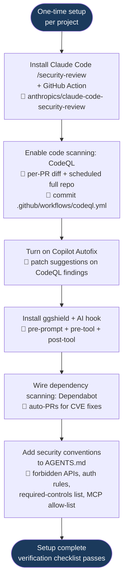
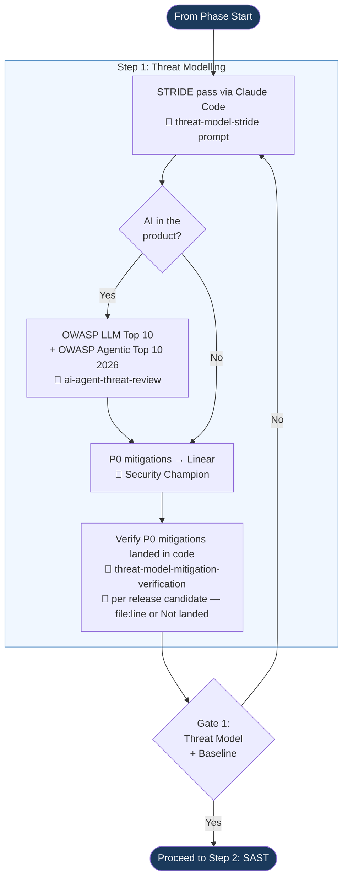
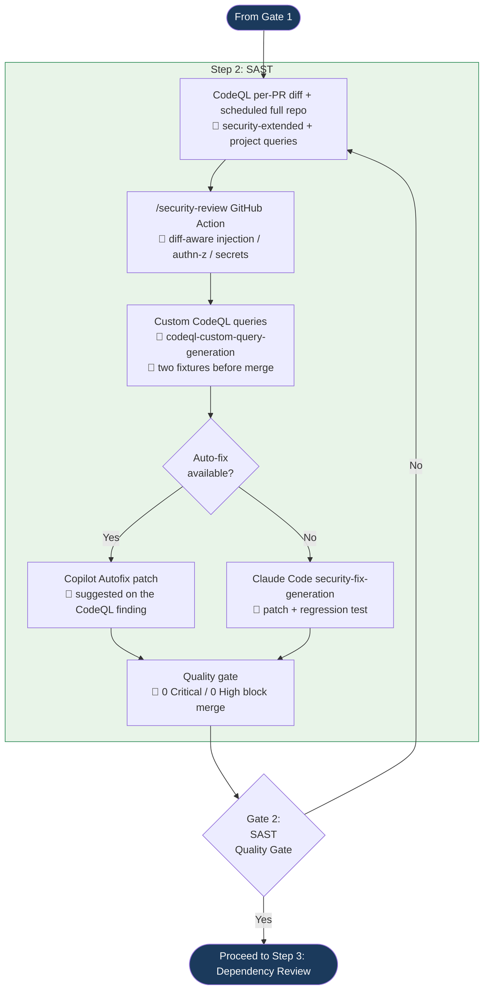
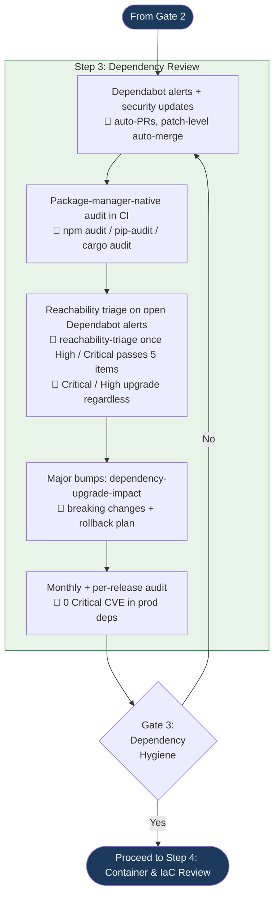
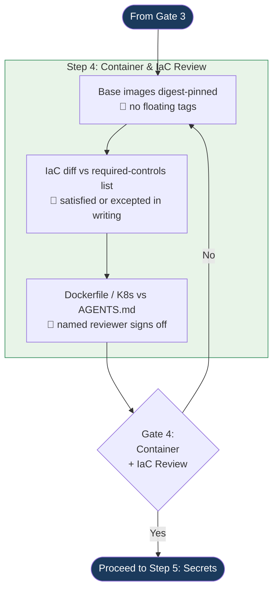
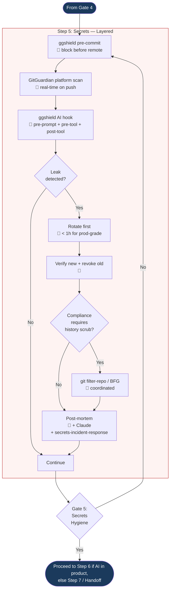
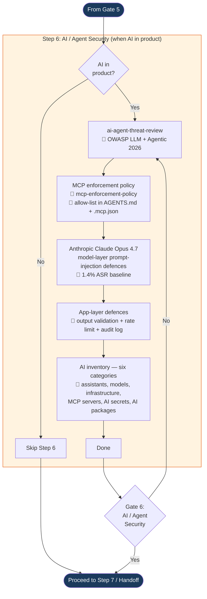
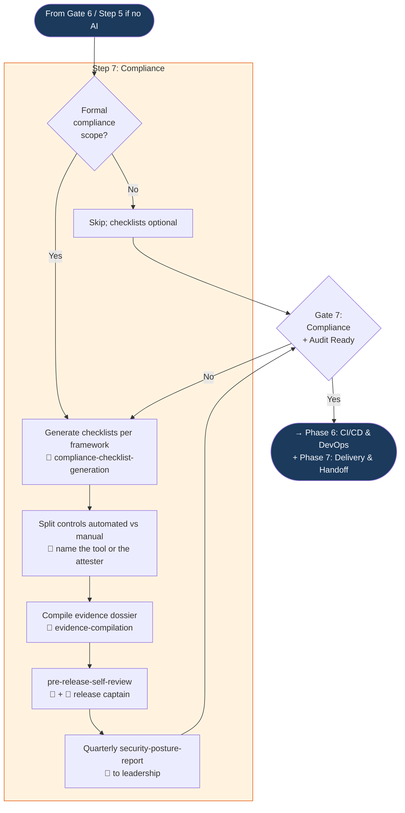

# Phase 5: Security & Compliance — Process Flowchart

This flowchart visualises the [Phase 5 PROCESS](./PROCESS.md). The phase flow is now split into a **high-level overview** plus **seven per-step detail diagrams** (Step 1 Threat Modelling → Step 7 Compliance), with a separate Step 0 one-time setup diagram. Gates 1–7 link adjacent step detail diagrams; the overview shows the cross-step routing (AI-in-product bypass around Step 6, compliance-scope bypass around Step 7). Each detail diagram terminates at its gate, and a "No" gate result loops back to the start of the same step. Gate definitions live in [QUALITY-GATES.md](./QUALITY-GATES.md). The 🤖 / 👤 markers show which actions are AI-driven and which require a human decision.

## Abbreviations

| Abbreviation | Meaning |
|--------------|---------|
| ASR | Attack Success Rate (prompt-injection benchmark) |
| BFG | BFG Repo-Cleaner (git history rewriter) |
| CIS | Center for Internet Security |
| CVE | Common Vulnerabilities and Exposures |
| FP | False Positive |
| GHAS | GitHub Advanced Security |
| HIPAA | Health Insurance Portability and Accountability Act |
| IaC | Infrastructure as Code |
| ISO | International Organization for Standardization |
| LLM | Large Language Model |
| MCP | Model Context Protocol |
| NIST | National Institute of Standards and Technology |
| NIST AI RMF | NIST AI Risk Management Framework |
| OSS | Open Source Software |
| OWASP | Open Worldwide Application Security Project |
| PR | Pull Request |
| RCA | Root Cause Analysis |
| SAST | Static Application Security Testing |
| SCA | Software Composition Analysis |
| SOC 2 | Service Organization Control 2 (audit framework) |
| STRIDE | Spoofing, Tampering, Repudiation, Information disclosure, DoS, Elevation of privilege |

---

## Step 0: One-Time Setup


```mermaid
flowchart TD
    SETUP_START([One-time setup<br/>per project]) --> SR_CMD

    SR_CMD[Install Claude Code /security-review<br/>+ GitHub Action<br/>🤖 anthropics/claude-code-security-review] --> CODEQL_SETUP
    CODEQL_SETUP[Enable code scanning: CodeQL<br/>🤖 per-PR diff + scheduled full repo<br/>👤 commit .github/workflows/codeql.yml] --> AUTOFIX_ON
    AUTOFIX_ON[Turn on Copilot Autofix<br/>🤖 patch suggestions on CodeQL findings] --> GG_AI
    GG_AI[Install ggshield + AI hook<br/>🤖 pre-prompt + pre-tool + post-tool] --> DEPENDABOT
    DEPENDABOT[Wire dependency scanning: Dependabot<br/>🤖 auto-PRs for CVE fixes] --> AGENTS_MD
    AGENTS_MD[Add security conventions<br/>to AGENTS.md<br/>👤 forbidden APIs, auth rules,<br/>required-controls list, MCP allow-list] --> SETUP_DONE
    SETUP_DONE([Setup complete<br/>verification checklist passes])

    style SETUP_START fill:#1B3A5C,color:#fff
    style SETUP_DONE fill:#1B3A5C,color:#fff
```

---

## End-to-End Phase Flow — Overview

High-level flow across all seven steps. Each step box below maps to a per-step **Detail** diagram further down this page. Gate 1–7 names match [QUALITY-GATES.md](./QUALITY-GATES.md); a "No" at any gate loops back to the start of that step (shown in the detail diagrams).


```mermaid
flowchart TD
    START([Phase 5: Security & Compliance<br/>Continuous from project start]) --> S1

    S1[Step 1: Threat Modelling]
    S2[Step 2: SAST]
    S3[Step 3: Dependency Review]
    S4[Step 4: Container & IaC Review]
    S5["Step 5: Secrets — Layered"]
    S6["Step 6: AI / Agent Security (when AI in product)"]
    S7[Step 7: Compliance]

    S1 --> GATE1{Gate 1:<br/>Threat Model<br/>+ Baseline}
    GATE1 -- No --> S1
    GATE1 -- Yes --> S2

    S2 --> GATE2{Gate 2:<br/>SAST<br/>Quality Gate}
    GATE2 -- No --> S2
    GATE2 -- Yes --> S3

    S3 --> GATE3{Gate 3:<br/>Dependency<br/>Hygiene}
    GATE3 -- No --> S3
    GATE3 -- Yes --> S4

    S4 --> GATE4{Gate 4:<br/>Container<br/>+ IaC Review}
    GATE4 -- No --> S4
    GATE4 -- Yes --> S5

    S5 --> GATE5{Gate 5:<br/>Secrets<br/>Hygiene}
    GATE5 -- No --> S5
    GATE5 -- Yes --> AI_IN_PROD

    AI_IN_PROD{AI in<br/>product?}
    AI_IN_PROD -- Yes --> S6
    AI_IN_PROD -- No --> COMP_SCOPE

    S6 --> GATE6{Gate 6:<br/>AI / Agent<br/>Security}
    GATE6 -- No --> S6
    GATE6 -- Yes --> COMP_SCOPE

    COMP_SCOPE{Formal<br/>compliance<br/>scope?}
    COMP_SCOPE -- Yes --> S7
    COMP_SCOPE -- No --> HANDOFF

    S7 --> GATE7{Gate 7:<br/>Compliance<br/>+ Audit Ready}
    GATE7 -- No --> S7
    GATE7 -- Yes --> HANDOFF

    HANDOFF([→ Phase 6: CI/CD & DevOps<br/>+ Phase 7: Delivery & Handoff])

    click S1 "#step-1-threat-modelling--detail"
    click S2 "#step-2-sast--detail"
    click S3 "#step-3-dependency-review--detail"
    click S4 "#step-4-container--iac-review--detail"
    click S5 "#step-5-secrets--layered--detail"
    click S6 "#step-6-ai--agent-security--detail"
    click S7 "#step-7-compliance--detail"

    style START fill:#1B3A5C,color:#fff
    style HANDOFF fill:#1B3A5C,color:#fff
    style S1 fill:#f0f7ff,stroke:#2E75B6
    style S2 fill:#e8f4e8,stroke:#2E8B57
    style S3 fill:#e8f4e8,stroke:#2E8B57
    style S4 fill:#e8f4e8,stroke:#2E8B57
    style S5 fill:#fef3f2,stroke:#B91C1C
    style S6 fill:#fff3e0,stroke:#E65100
    style S7 fill:#fff3e0,stroke:#E65100
```

---

## Step 1: Threat Modelling — Detail


```mermaid
flowchart TD
    ENTRY([From Phase Start]) --> THREAT

    subgraph THREAT_STEP["Step 1: Threat Modelling"]
        THREAT[STRIDE pass via Claude Code<br/>🤖 threat-model-stride prompt] --> AI_THREAT
        AI_THREAT{AI in the<br/>product?}
        AI_THREAT -- Yes --> OWASP_AGENT[OWASP LLM Top 10<br/>+ OWASP Agentic Top 10 2026<br/>🤖 ai-agent-threat-review] --> P0_TICKET
        AI_THREAT -- No --> P0_TICKET
        P0_TICKET[P0 mitigations → Linear<br/>👤 Security Champion] --> MITIG_VERIFY
        MITIG_VERIFY["Verify P0 mitigations landed in code<br/>🤖 threat-model-mitigation-verification<br/>👤 per release candidate — file:line or Not landed"]
    end

    MITIG_VERIFY --> GATE1{Gate 1:<br/>Threat Model<br/>+ Baseline}
    GATE1 -- No --> THREAT
    GATE1 -- Yes --> NEXT([Proceed to Step 2: SAST])

    style ENTRY fill:#1B3A5C,color:#fff
    style NEXT fill:#1B3A5C,color:#fff
    style THREAT_STEP fill:#f0f7ff,stroke:#2E75B6
```

---

## Step 2: SAST — Detail


```mermaid
flowchart TD
    ENTRY([From Gate 1]) --> SAST

    subgraph SAST_STEP["Step 2: SAST"]
        SAST[CodeQL per-PR diff + scheduled full repo<br/>🤖 security-extended + project queries] --> SR
        SR["/security-review GitHub Action<br/>🤖 diff-aware injection / authn-z / secrets"] --> CUSTOM
        CUSTOM[Custom CodeQL queries<br/>🤖 codeql-custom-query-generation<br/>👤 two fixtures before merge] --> AUTOFIX
        AUTOFIX{Auto-fix<br/>available?}
        AUTOFIX -- Yes --> COPILOT_FIX[Copilot Autofix patch<br/>🤖 suggested on the CodeQL finding]
        AUTOFIX -- No --> CLAUDE_FIX[Claude Code security-fix-generation<br/>🤖 patch + regression test]
        COPILOT_FIX --> SAST_GATE
        CLAUDE_FIX --> SAST_GATE
        SAST_GATE[Quality gate<br/>👤 0 Critical / 0 High block merge]
    end

    SAST_GATE --> GATE2{Gate 2:<br/>SAST<br/>Quality Gate}
    GATE2 -- No --> SAST
    GATE2 -- Yes --> NEXT([Proceed to Step 3: Dependency Review])

    style ENTRY fill:#1B3A5C,color:#fff
    style NEXT fill:#1B3A5C,color:#fff
    style SAST_STEP fill:#e8f4e8,stroke:#2E8B57
```

---

## Step 3: Dependency Review — Detail


```mermaid
flowchart TD
    ENTRY([From Gate 2]) --> DEPS

    subgraph DEP_STEP["Step 3: Dependency Review"]
        DEPS[Dependabot alerts + security updates<br/>🤖 auto-PRs, patch-level auto-merge] --> NATIVE_AUDIT
        NATIVE_AUDIT[Package-manager-native audit in CI<br/>🤖 npm audit / pip-audit / cargo audit] --> REACH
        REACH["Reachability triage on open Dependabot alerts<br/>🤖 reachability-triage once High / Critical passes 5 items<br/>👤 Critical / High upgrade regardless"] --> UPGRADE
        UPGRADE[Major bumps: dependency-upgrade-impact<br/>🤖 breaking changes + rollback plan] --> DEP_AUDIT
        DEP_AUDIT[Monthly + per-release audit<br/>👤 0 Critical CVE in prod deps]
    end

    DEP_AUDIT --> GATE3{Gate 3:<br/>Dependency<br/>Hygiene}
    GATE3 -- No --> DEPS
    GATE3 -- Yes --> NEXT([Proceed to Step 4: Container & IaC Review])

    style ENTRY fill:#1B3A5C,color:#fff
    style NEXT fill:#1B3A5C,color:#fff
    style DEP_STEP fill:#e8f4e8,stroke:#2E8B57
```

---

## Step 4: Container & IaC Review — Detail


```mermaid
flowchart TD
    ENTRY([From Gate 3]) --> IMG

    subgraph CONTAINER_STEP["Step 4: Container & IaC Review"]
        IMG[Base images digest-pinned<br/>👤 no floating tags] --> CONTROLS
        CONTROLS[IaC diff vs required-controls list<br/>👤 satisfied or excepted in writing] --> CONV_CHK
        CONV_CHK[Dockerfile / K8s vs AGENTS.md<br/>👤 named reviewer signs off]
    end

    CONV_CHK --> GATE4{Gate 4:<br/>Container<br/>+ IaC Review}
    GATE4 -- No --> IMG
    GATE4 -- Yes --> NEXT([Proceed to Step 5: Secrets])

    style ENTRY fill:#1B3A5C,color:#fff
    style NEXT fill:#1B3A5C,color:#fff
    style CONTAINER_STEP fill:#e8f4e8,stroke:#2E8B57
```

---

## Step 5: Secrets — Layered — Detail


```mermaid
flowchart TD
    ENTRY([From Gate 4]) --> SECRETS

    subgraph SECRETS_STEP["Step 5: Secrets — Layered"]
        SECRETS[ggshield pre-commit<br/>🤖 block before remote] --> GG_PUSH
        GG_PUSH[GitGuardian platform scan<br/>🤖 real-time on push] --> GG_AI_HOOK
        GG_AI_HOOK[ggshield AI hook<br/>🤖 pre-prompt + pre-tool + post-tool]
        GG_AI_HOOK --> LEAK{Leak<br/>detected?}
        LEAK -- Yes --> ROTATE[Rotate first<br/>👤 < 1h for prod-grade]
        ROTATE --> VERIFY[Verify new + revoke old<br/>👤]
        VERIFY --> SCRUB{Compliance<br/>requires<br/>history scrub?}
        SCRUB -- Yes --> FILTER[git filter-repo / BFG<br/>👤 coordinated]
        SCRUB -- No --> POSTMORTEM[Post-mortem<br/>👤 + Claude<br/>+ secrets-incident-response]
        FILTER --> POSTMORTEM
        LEAK -- No --> SECRETS_OK[Continue]
        POSTMORTEM --> SECRETS_OK
    end

    SECRETS_OK --> GATE5{Gate 5:<br/>Secrets<br/>Hygiene}
    GATE5 -- No --> SECRETS
    GATE5 -- Yes --> NEXT([Proceed to Step 6 if AI in product,<br/>else Step 7 / Handoff])

    style ENTRY fill:#1B3A5C,color:#fff
    style NEXT fill:#1B3A5C,color:#fff
    style SECRETS_STEP fill:#fef3f2,stroke:#B91C1C
```

---

## Step 6: AI / Agent Security — Detail


```mermaid
flowchart TD
    ENTRY([From Gate 5]) --> AI_SEC

    subgraph AI_SEC_STEP["Step 6: AI / Agent Security (when AI in product)"]
        AI_SEC{AI in<br/>product?}
        AI_SEC -- No --> SKIP_AI[Skip Step 6]
        AI_SEC -- Yes --> AI_REVIEW[ai-agent-threat-review<br/>🤖 OWASP LLM + Agentic 2026]
        AI_REVIEW --> MCP_POL[MCP enforcement policy<br/>🤖 mcp-enforcement-policy<br/>👤 allow-list in AGENTS.md + .mcp.json]
        MCP_POL --> ANTH[Anthropic Claude Opus 4.7<br/>model-layer prompt-injection defences<br/>🤖 1.4% ASR baseline]
        ANTH --> APP_DEFENCE[App-layer defences<br/>🤖 output validation + rate limit + audit log]
        APP_DEFENCE --> INVENTORY[AI inventory — six categories<br/>👤 assistants, models, infrastructure,<br/>MCP servers, AI secrets, AI packages]
        INVENTORY --> AI_DONE[Done]
    end

    SKIP_AI --> NEXT([Proceed to Step 7 / Handoff])
    AI_DONE --> GATE6{Gate 6:<br/>AI / Agent<br/>Security}
    GATE6 -- No --> AI_REVIEW
    GATE6 -- Yes --> NEXT

    style ENTRY fill:#1B3A5C,color:#fff
    style NEXT fill:#1B3A5C,color:#fff
    style AI_SEC_STEP fill:#fff3e0,stroke:#E65100
```

---

## Step 7: Compliance — Detail


```mermaid
flowchart TD
    ENTRY([From Gate 6 / Step 5 if no AI]) --> COMPLIANCE

    subgraph COMPLIANCE_STEP["Step 7: Compliance"]
        COMPLIANCE{Formal<br/>compliance<br/>scope?}
        COMPLIANCE -- No --> SKIP_COMP["Skip; checklists optional"]
        COMPLIANCE -- Yes --> CHECKLIST[Generate checklists per framework<br/>🤖 compliance-checklist-generation]
        CHECKLIST --> SPLIT[Split controls automated vs manual<br/>👤 name the tool or the attester]
        SPLIT --> EVIDENCE[Compile evidence dossier<br/>🤖 evidence-compilation]
        EVIDENCE --> SELF_REVIEW[pre-release-self-review<br/>🤖 + 👤 release captain]
        SELF_REVIEW --> POSTURE[Quarterly security-posture-report<br/>🤖 to leadership]
    end

    SKIP_COMP --> GATE7{Gate 7:<br/>Compliance<br/>+ Audit Ready}
    POSTURE --> GATE7
    GATE7 -- No --> CHECKLIST
    GATE7 -- Yes --> HANDOFF([→ Phase 6: CI/CD & DevOps<br/>+ Phase 7: Delivery & Handoff])

    style ENTRY fill:#1B3A5C,color:#fff
    style HANDOFF fill:#1B3A5C,color:#fff
    style COMPLIANCE_STEP fill:#fff3e0,stroke:#E65100
```

---

## Step-by-Step Anchors

The PROCESS.md links into these sections by anchor — keep the headings stable.

### Step 1: Threat Modelling
STRIDE + (if AI is in product) OWASP LLM Top 10 + OWASP Top 10 for Agentic Applications 2026 — outputs `/docs/security/threat-model.md` and P0 Linear tickets. Before each release candidate the step closes its own loop: a mitigation-verification pass locates the implementing code for every P0 item and cites `file:line`, or reports it **not landed**. See [PROCESS.md → Step 1](./PROCESS.md#step-1-threat-modelling--security-architecture-review).

### Step 2: SAST
CodeQL, via GHAS code scanning, is the SAST baseline — per-PR diff analysis **and** a scheduled full-repo scan, plus project-specific custom queries committed under `.github/codeql/` and verified against two fixtures so a high-FP query gets tightened rather than tolerated. Claude Code `/security-review` is the diff-aware semantic layer on top; GitHub Copilot Autofix patches CodeQL findings. See [PROCESS.md → Step 2](./PROCESS.md#step-2-sast--continuous-ai-assisted-static-analysis).

### Step 3: Dependency Review
Dependabot owns the SCA capability — alerts, security updates, version updates, patch-level auto-merge — supplemented by package-manager-native audit (`npm audit` / `pip-audit` / `cargo audit`) in CI. Once the open High / Critical list runs long, Claude Code triages it by reachability against the repo's entry points and returns a merge order; the triage is an aid, not a verdict, and Critical / High still upgrade when classified not reachable. Infracost cross-link from Phase 6 for upgrade cost impact. See [PROCESS.md → Step 3](./PROCESS.md#step-3-dependency-review).

### Step 4: Container & IaC Review
Human review only. Base images digest-pinned; Dockerfiles and K8s manifests checked against `AGENTS.md`; IaC diffs walked against the CIS / NIST-aligned required-controls list, each control satisfied or excepted in writing. No scanner, policy engine, or admission controller enforces this surface — a named reviewer does. See [PROCESS.md → Step 4](./PROCESS.md#step-4-container--iac-review).

### Step 5: Secrets
ggshield pre-commit + GitGuardian platform + ggshield AI hook (pre-prompt + pre-tool-use + post-tool-use) for Claude Code. See [PROCESS.md → Step 5](./PROCESS.md#step-5-secrets--layered-defence-with-ai-hooks).

### Step 6: AI Agent Security
OWASP LLM Top 10 + OWASP Top 10 for Agentic Applications 2026; Anthropic Claude Opus 4.7 model-layer defences; MCP allow-list in `AGENTS.md` pinned by the project-scoped `.mcp.json`; six-category AI inventory at `/docs/security/ai-inventory.md`. See [PROCESS.md → Step 6](./PROCESS.md#step-6-ai--agent-specific-security).

### Step 7: Compliance
Claude for checklists + evidence; CodeQL / Dependabot / GitGuardian / `/security-review` as the automated control evidence, with dated manual attestation for everything they do not cover — including all container and IaC controls — across SOC 2 / ISO 27001 / HIPAA and peers; NIST AI RMF + ISO/IEC 42001 crosswalk if AI is in the product. See [PROCESS.md → Step 7](./PROCESS.md#step-7-compliance--ai-generated-checklists-evidence-and-audit).

---

## Key Decision Points

1. **AI in the product?** — Drives whether Steps 1.2 + 6 are mandatory or skipped. If yes, the OWASP LLM Top 10 + OWASP Agentic Top 10 are required; ASI01 Agent Goal Hijacking is the top risk in 2026.
2. **Compliance certification scope?** — Drives whether Step 7 runs and how much evidence must be collected. There is no compliance platform in this stack: checklists come from Claude, and every control is either tool-verified with a named tool or manually attested with a named person and a date.
3. **History scrub on secret leak?** — Only if compliance requires immutable record. **Rotation is the primary mitigation; history scrubbing is cosmetic.**

---

## The Developer Experience

```
Developer's day:
  PR opened → CI runs (CodeQL diff analysis + /security-review + ggshield) →
  Copilot Autofix posts patch suggestions on CodeQL findings →
  Container / IaC changes get a named human reviewer against AGENTS.md →
  Critical/High findings block merge until resolved →
  Custom CodeQL query for any project-specific pattern →
  Human approval; merge

Per release:
  threat-model-mitigation-verification → every P0 mitigation Landed with a file:line, or deferred with sign-off →
  reachability-triage on the open Dependabot High / Critical list once it runs long →
  pre-release-self-review prompt before clicking prod-deploy →
  All seven gates green (Gate 6 only if AI in product, Gate 7 only if certifying) →
  Deploy

Quarterly:
  security-posture-report to leadership →
  Secret rotation drill →
  GitGuardian historical scan re-run; AI inventory reviewed →
  AGENTS.md security conventions reviewed and updated

Incident (secret leak / vuln disclosed):
  ggshield AI hook OR GitGuardian fires →
  secrets-incident-response prompt for the runbook →
  Rotate first (< 1h prod-grade), scrub second (only if compliance requires) →
  Post-mortem within 48h; process change to prevent recurrence
```
