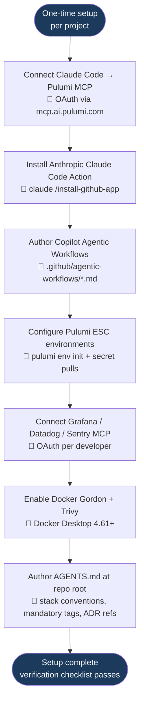
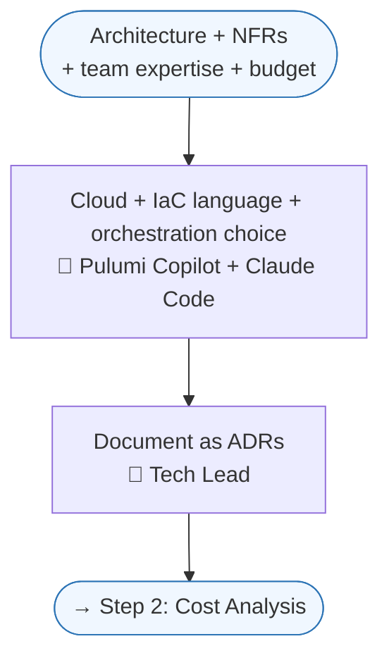
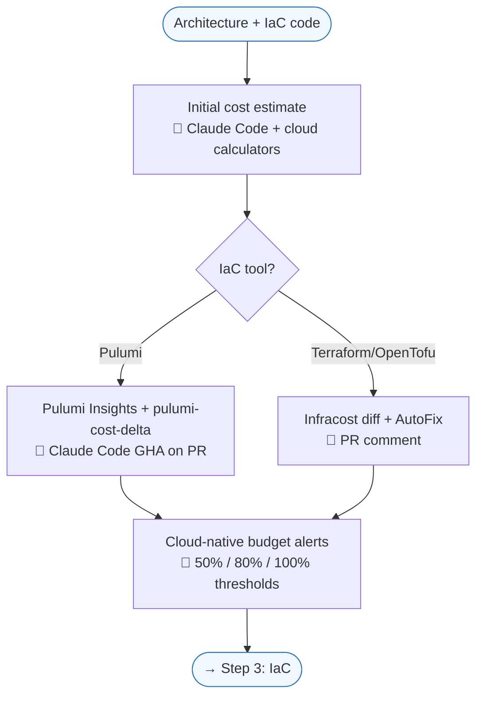
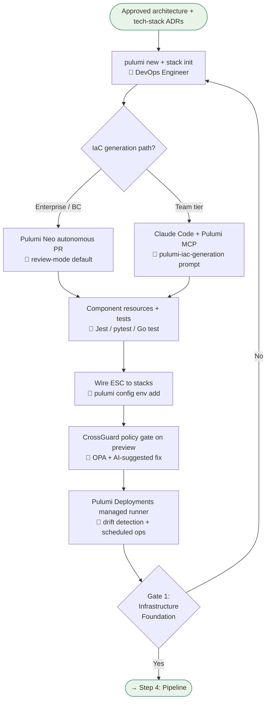
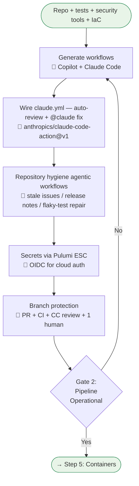
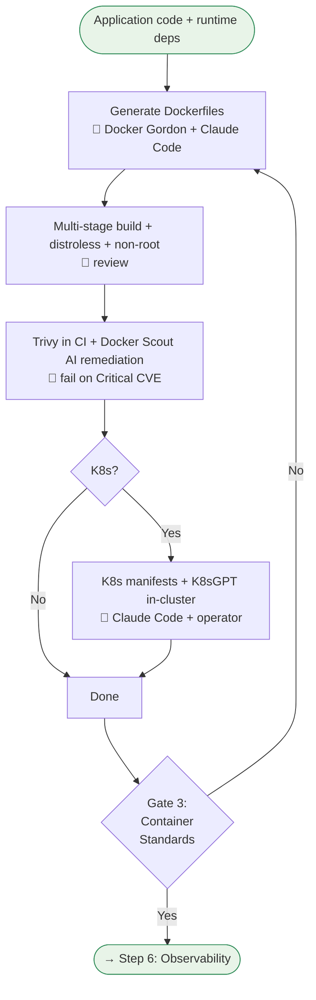
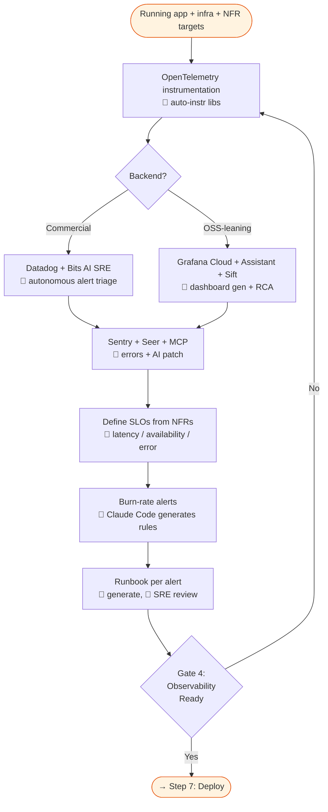
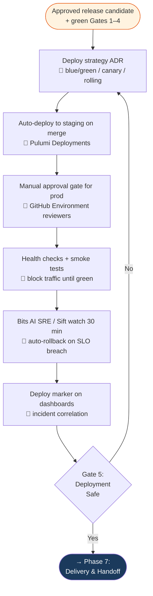

# Phase 6: CI/CD & DevOps — Process Flowchart

This flowchart visualises the [Phase 6 PROCESS](./PROCESS.md). Each per-step diagram corresponds to a step section; gates map to [QUALITY-GATES.md](./QUALITY-GATES.md). The 🤖 / 👤 markers show which actions are AI-driven and which require a human decision.

## Abbreviations

| Abbreviation | Meaning |
|--------------|---------|
| ADR | Architecture Decision Record |
| BC | Business Critical (Pulumi licensing tier) |
| CC | Claude Code |
| CI / CD | Continuous Integration / Continuous Delivery (or Deployment) |
| CrossGuard | Pulumi's policy-as-code engine |
| CVE | Common Vulnerabilities and Exposures |
| e2e | End-to-end |
| ESC | Pulumi Environments, Secrets and Configuration |
| FinOps | Cloud Financial Operations |
| GA | General Availability |
| GHA | GitHub Action |
| HCL | HashiCorp Configuration Language |
| IaC | Infrastructure as Code |
| K8s | Kubernetes |
| MCP | Model Context Protocol |
| NFR | Non-Functional Requirement |
| OIDC | OpenID Connect |
| OPA | Open Policy Agent |
| OSS | Open Source Software |
| PR | Pull Request |
| RC | Release Candidate |
| RCA | Root Cause Analysis |
| SLO | Service Level Objective |
| SRE | Site Reliability Engineer |
| YAML | YAML Ain't Markup Language |

---

## Step 0: One-Time Setup



---

## End-to-End Phase Flow Overview

High-level chain across all seven steps. Each step has its own detailed flowchart below.

```mermaid
flowchart LR
    START([Phase 6 Input:<br/>Architecture + Code + Tests + AGENTS.md]) --> S1[Step 1<br/>Tech Stack]
    S1 --> S2[Step 2<br/>Cost & FinOps]
    S2 --> S3[Step 3<br/>IaC with Pulumi AI]
    S3 --> G1{Gate 1}
    G1 --> S4[Step 4<br/>CI/CD Pipeline]
    S4 --> G2{Gate 2}
    G2 --> S5[Step 5<br/>Containerization]
    S5 --> G3{Gate 3}
    G3 --> S6[Step 6<br/>Observability]
    S6 --> G4{Gate 4}
    G4 --> S7[Step 7<br/>Deployment]
    S7 --> G5{Gate 5}
    G5 --> HANDOFF([→ Phase 7:<br/>Delivery & Handoff])

    style START fill:#1B3A5C,color:#fff
    style HANDOFF fill:#1B3A5C,color:#fff
    style S1 fill:#f0f7ff,stroke:#2E75B6
    style S2 fill:#f0f7ff,stroke:#2E75B6
    style S3 fill:#e8f4e8,stroke:#2E8B57
    style S4 fill:#e8f4e8,stroke:#2E8B57
    style S5 fill:#e8f4e8,stroke:#2E8B57
    style S6 fill:#fff3e0,stroke:#E65100
    style S7 fill:#fff3e0,stroke:#E65100
```



---

## Step 1: Tech Stack

Cloud + IaC language + orchestration + observability ADRs that gate everything downstream.



---

## Step 2: Cost

Cost-on-PR via Pulumi Insights (or Infracost for HCL paths) + cloud-native budget alerts.



---

## Step 3: IaC

Pulumi Neo (autonomous, Enterprise+) or Claude Code + Pulumi MCP (Team tier) generate the stacks; CrossGuard gates; Pulumi Deployments runs them.



---

## Step 4: Pipeline

GitHub Actions + Copilot for YAML, Anthropic Claude Code Action for PR review and `@claude` fix-on-mention, Copilot Agentic Workflows for repo hygiene.



---

## Step 5: Containers

Docker Gordon + Claude Code for Dockerfile generation, Trivy + Docker Scout for scanning, K8sGPT for cluster diagnostics.



---

## Step 6: Observability

OpenTelemetry instrumentation; Datadog + Bits AI SRE *or* Grafana + Assistant + Sift; Sentry + Seer for errors; SLOs and runbooks per alert.



---

## Step 7: Deploy

Pulumi Deployments for staging auto-deploy, GitHub Environments for prod manual approval, AI-watched 30-min post-deploy window with auto-rollback on SLO breach.



---

## Step-by-Step Anchors

The PROCESS.md links into these sections by anchor — keep the headings stable.

### Step 1: Tech Stack
The cloud + IaC language + orchestration + observability ADRs that gate everything downstream. See [PROCESS.md → Step 1](./PROCESS.md#step-1-infrastructure-tech-stack-selection).

### Step 2: Cost
Cost-on-PR via Pulumi Insights (or Infracost for HCL paths) + quarterly optimisation review. See [PROCESS.md → Step 2](./PROCESS.md#step-2-cost-analysis--finops).

### Step 3: IaC
Pulumi Neo (autonomous, Enterprise+) or Claude Code + Pulumi MCP (Team tier) generate the stacks; CrossGuard gates; Pulumi Deployments runs them. See [PROCESS.md → Step 3](./PROCESS.md#step-3-infrastructure-provisioning-iac-with-pulumi-ai).

### Step 4: Pipeline
GitHub Actions + Copilot for YAML, Anthropic Claude Code Action for PR review and `@claude` fix-on-mention, Copilot Agentic Workflows for repo hygiene. See [PROCESS.md → Step 4](./PROCESS.md#step-4-cicd-pipeline-setup).

### Step 5: Containers
Docker Gordon + Claude Code for Dockerfile generation, Trivy + Docker Scout for scanning, K8sGPT for cluster diagnostics. See [PROCESS.md → Step 5](./PROCESS.md#step-5-containerization).

### Step 6: Observability
OpenTelemetry instrumentation; Datadog + Bits AI SRE *or* Grafana + Assistant + Sift; Sentry + Seer for errors. See [PROCESS.md → Step 6](./PROCESS.md#step-6-observability--logging-monitoring-alerting).

### Step 7: Deploy
Pulumi Deployments for staging auto-deploy, GitHub Environments for prod manual approval, AI-watched 30-min post-deploy window with auto-rollback on SLO breach. See [PROCESS.md → Step 7](./PROCESS.md#step-7-deployment-automation--rollback).

---

## Key Decision Points

1. **Pulumi Neo vs Claude Code path?** Neo is gated to Enterprise / Business Critical; Team-tier orgs use Claude Code + Pulumi MCP for the same review-mode workflow without the autonomous-task assignment.
2. **Datadog vs Grafana?** Datadog wins on autonomous incident triage today (Bits AI SRE GA, 2× faster in 2026); Grafana wins on cost and OSS portability (Assistant became free in April 2026).
3. **Pulumi vs OpenTofu?** Pulumi is the default in 2026 — real languages, native testing, Apache 2.0, deepest AI integration. Stay on OpenTofu only when HCL skills dominate the team or a critical provider is HCL-only.
4. **Manual approval before prod?** Always. Automate the path, gate the button.
5. **Auto-rollback trigger?** SLO breach within 10 min of deploy fires a `repository_dispatch` to roll back the last `pulumi up`.

---

## The Developer Experience

```
Developer's day:
  PR opened → CI runs (Pulumi preview + cost + tests + scans) →
  Claude Code Action posts review → CrossGuard gates pass →
  Human approval → Merge → Pulumi Deployments → Staging

Release day:
  Tag RC → Full e2e + load tests → Manual approval → Prod deploy (blue/green) →
  Bits AI SRE / Sift watch first 30 min → Deploy marker on dashboards →
  Either celebrate or auto-rollback fires

Incident day:
  Alert fires → Bits AI SRE / Sift posts hypothesis + correlated deploy →
  On-call opens runbook → Claude Code with observability MCP triages →
  Mitigate → Post-mortem within 48h
```
