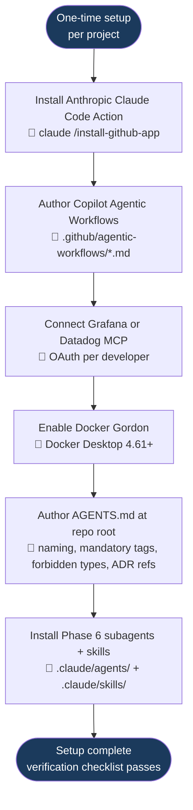
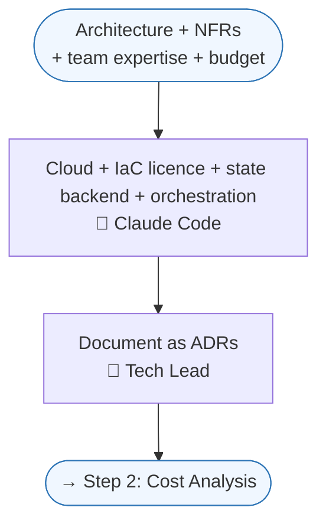
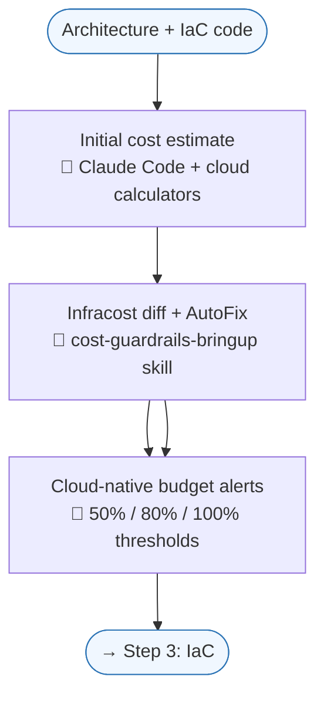
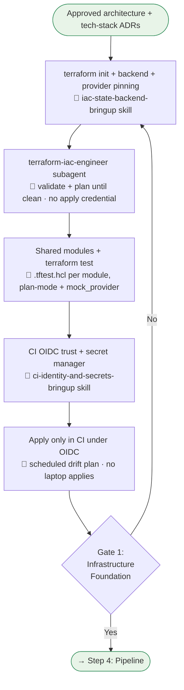
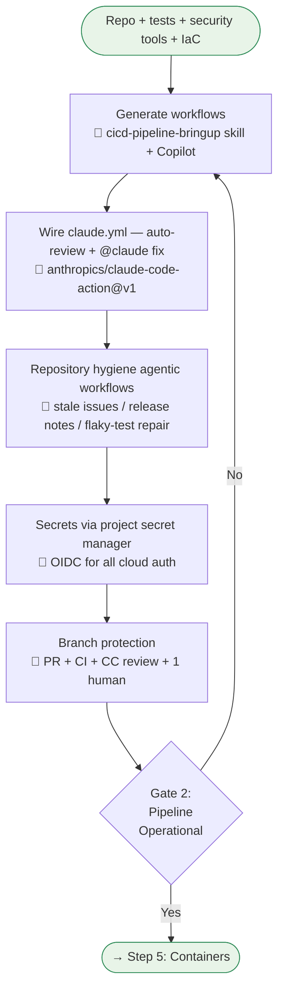
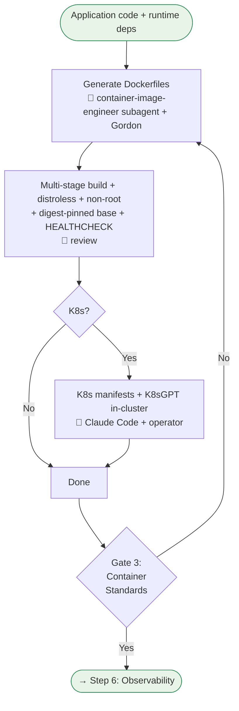
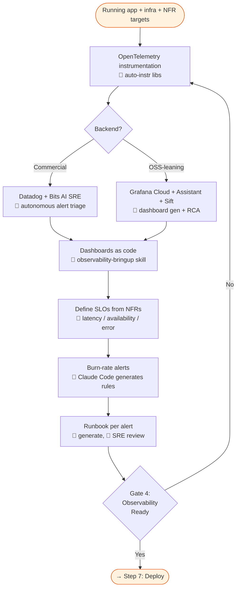
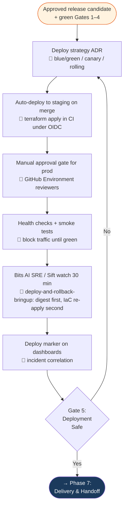

# Phase 6: CI/CD & DevOps — Process Flowchart

This flowchart visualises the [Phase 6 PROCESS](./PROCESS.md). Each per-step diagram corresponds to a step section; gates map to [QUALITY-GATES.md](./QUALITY-GATES.md). The 🤖 / 👤 markers show which actions are AI-driven and which require a human decision.

## Abbreviations

| Abbreviation | Meaning |
|--------------|---------|
| ADR | Architecture Decision Record |
| BSL | Business Source License |
| CC | Claude Code |
| CI / CD | Continuous Integration / Continuous Delivery (or Deployment) |
| CVE | Common Vulnerabilities and Exposures |
| e2e | End-to-end |
| MPL | Mozilla Public License |
| FinOps | Cloud Financial Operations |
| GA | General Availability |
| GHA | GitHub Action |
| HCL | HashiCorp Configuration Language |
| IaC | Infrastructure as Code |
| K8s | Kubernetes |
| MCP | Model Context Protocol |
| NFR | Non-Functional Requirement |
| OIDC | OpenID Connect |
| OSS | Open Source Software |
| PR | Pull Request |
| RC | Release Candidate |
| RCA | Root Cause Analysis |
| SLO | Service Level Objective |
| SRE | Site Reliability Engineer |
| YAML | YAML Ain't Markup Language |

---

## Step 0: One-Time Setup


```mermaid
flowchart TD
    SETUP_START([One-time setup<br/>per project]) --> ACTION_INSTALL

    ACTION_INSTALL[Install Anthropic Claude Code Action<br/>🤖 claude /install-github-app] --> AGENTIC
    AGENTIC[Author Copilot Agentic Workflows<br/>👤 .github/agentic-workflows/*.md] --> OBS_MCP
    OBS_MCP[Connect Grafana or Datadog MCP<br/>🤖 OAuth per developer] --> DOCKER
    DOCKER[Enable Docker Gordon<br/>🤖 Docker Desktop 4.61+] --> AGENTS_MD
    AGENTS_MD[Author AGENTS.md at repo root<br/>👤 naming, mandatory tags, forbidden types, ADR refs] --> HELPERS
    HELPERS[Install Phase 6 subagents + skills<br/>👤 .claude/agents/ + .claude/skills/] --> SETUP_DONE
    SETUP_DONE([Setup complete<br/>verification checklist passes])

    style SETUP_START fill:#1B3A5C,color:#fff
    style SETUP_DONE fill:#1B3A5C,color:#fff
```

---

## End-to-End Phase Flow Overview

High-level chain across all seven steps. Each step has its own detailed flowchart below.


```mermaid
flowchart LR
    START([Phase 6 Input:<br/>Architecture + Code + Tests + AGENTS.md]) --> S1[Step 1<br/>Tech Stack]
    S1 --> S2[Step 2<br/>Cost & FinOps]
    S2 --> S3[Step 3<br/>IaC with Terraform]
    S3 --> G1{Gate 1}
    G1 --> S4[Step 4<br/>CI/CD Pipeline]
    S4 --> G2{Gate 2}
    G2 --> S5[Step 5<br/>Containerization]
    S5 --> G3{Gate 3}
    G3 --> S6[Step 6<br/>Observability]
    S6 --> G4{Gate 4}
    G4 --> S7[Step 7<br/>Deployment]
    S7 --> G5{Gate 5}
    G5 --> HANDOFF([→ Phase 7:<br/>Delivery & Handoff])

    style START fill:#1B3A5C,color:#fff
    style HANDOFF fill:#1B3A5C,color:#fff
    style S1 fill:#f0f7ff,stroke:#2E75B6
    style S2 fill:#f0f7ff,stroke:#2E75B6
    style S3 fill:#e8f4e8,stroke:#2E8B57
    style S4 fill:#e8f4e8,stroke:#2E8B57
    style S5 fill:#e8f4e8,stroke:#2E8B57
    style S6 fill:#fff3e0,stroke:#E65100
    style S7 fill:#fff3e0,stroke:#E65100
```

---

## Step 1: Tech Stack

Cloud + IaC language + orchestration + observability ADRs that gate everything downstream.


```mermaid
flowchart TD
    S1_IN([Architecture + NFRs<br/>+ team expertise + budget]) --> STACK
    STACK[Cloud + IaC licence + state backend + orchestration<br/>🤖 Claude Code] --> ADR
    ADR[Document as ADRs<br/>👤 Tech Lead] --> S1_OUT([→ Step 2: Cost Analysis])

    style S1_IN fill:#f0f7ff,stroke:#2E75B6
    style S1_OUT fill:#f0f7ff,stroke:#2E75B6
```

---

## Step 2: Cost

Cost-on-PR via Infracost — native Terraform / OpenTofu support, one path, no vendor bridge — plus cloud-native budget alerts.


```mermaid
flowchart TD
    S2_IN([Architecture + IaC code]) --> COST
    COST[Initial cost estimate<br/>🤖 Claude Code + cloud calculators] --> INFRACOST
    INFRACOST[Infracost diff + AutoFix<br/>🤖 cost-guardrails-bringup skill] --> BUDGET
    INFRACOST --> BUDGET
    BUDGET[Cloud-native budget alerts<br/>👤 50% / 80% / 100% thresholds] --> S2_OUT([→ Step 3: IaC])

    style S2_IN fill:#f0f7ff,stroke:#2E75B6
    style S2_OUT fill:#f0f7ff,stroke:#2E75B6
```

---

## Step 3: IaC

The `terraform-iac-engineer` subagent authors the HCL and loops `validate` + `plan`; the bring-up skills provision the backend, locking, OIDC and drift workflow; CI holds the only apply credential.


```mermaid
flowchart TD
    S3_IN([Approved architecture + tech-stack ADRs]) --> IAC
    IAC[terraform init + backend + provider pinning<br/>🤖 iac-state-backend-bringup skill] --> IAC_AGENT
    IAC_AGENT[terraform-iac-engineer subagent<br/>🤖 validate + plan until clean · no apply credential] --> MODULES
    MODULES[Shared modules + terraform test<br/>👤 .tftest.hcl per module, plan-mode + mock_provider] --> BACKEND
    BACKEND[CI OIDC trust + secret manager<br/>🤖 ci-identity-and-secrets-bringup skill] --> APPLY_CI
    APPLY_CI[Apply only in CI under OIDC<br/>🤖 scheduled drift plan · no laptop applies] --> GATE1
    GATE1{Gate 1:<br/>Infrastructure<br/>Foundation}
    GATE1 -- No --> IAC
    GATE1 -- Yes --> S3_OUT([→ Step 4: Pipeline])

    style S3_IN fill:#e8f4e8,stroke:#2E8B57
    style S3_OUT fill:#e8f4e8,stroke:#2E8B57
```

---

## Step 4: Pipeline

GitHub Actions + Copilot for YAML, Anthropic Claude Code Action for PR review and `@claude` fix-on-mention, Copilot Agentic Workflows for repo hygiene.


```mermaid
flowchart TD
    S4_IN([Repo + tests + security tools + IaC]) --> PIPELINE
    PIPELINE[Generate workflows<br/>🤖 cicd-pipeline-bringup skill + Copilot] --> CLAUDE_ACTION
    CLAUDE_ACTION[Wire claude.yml — auto-review + @claude fix<br/>🤖 anthropics/claude-code-action@v1] --> AGENTIC_HYGIENE
    AGENTIC_HYGIENE[Repository hygiene agentic workflows<br/>🤖 stale issues / release notes / flaky-test repair] --> SECRETS
    SECRETS[Secrets via project secret manager<br/>👤 OIDC for all cloud auth] --> BRANCH
    BRANCH[Branch protection<br/>👤 PR + CI + CC review + 1 human] --> GATE2
    GATE2{Gate 2:<br/>Pipeline<br/>Operational}
    GATE2 -- No --> PIPELINE
    GATE2 -- Yes --> S4_OUT([→ Step 5: Containers])

    style S4_IN fill:#e8f4e8,stroke:#2E8B57
    style S4_OUT fill:#e8f4e8,stroke:#2E8B57
```

---

## Step 5: Containers

Docker Gordon + Claude Code for Dockerfile generation, K8sGPT for cluster diagnostics.


```mermaid
flowchart TD
    S5_IN([Application code + runtime deps]) --> CONTAINER
    CONTAINER[Generate Dockerfiles<br/>🤖 container-image-engineer subagent + Gordon] --> MULTISTAGE
    MULTISTAGE[Multi-stage build + distroless + non-root<br/>+ digest-pinned base + HEALTHCHECK<br/>👤 review] --> K8S_OPT
    K8S_OPT{K8s?}
    K8S_OPT -- Yes --> K8S_MANIFESTS[K8s manifests + K8sGPT in-cluster<br/>🤖 Claude Code + operator]
    K8S_OPT -- No --> CONTAINER_DONE[Done]
    K8S_MANIFESTS --> CONTAINER_DONE
    CONTAINER_DONE --> GATE3
    GATE3{Gate 3:<br/>Container<br/>Standards}
    GATE3 -- No --> CONTAINER
    GATE3 -- Yes --> S5_OUT([→ Step 6: Observability])

    style S5_IN fill:#e8f4e8,stroke:#2E8B57
    style S5_OUT fill:#e8f4e8,stroke:#2E8B57
```

---

## Step 6: Observability

OpenTelemetry instrumentation; Datadog + Bits AI SRE *or* Grafana + Assistant + Sift; dashboards as code; SLOs and runbooks per alert.


```mermaid
flowchart TD
    S6_IN([Running app + infra + NFR targets]) --> OBS
    OBS[OpenTelemetry instrumentation<br/>🤖 auto-instr libs] --> BACKEND
    BACKEND{Backend?}
    BACKEND -- Commercial --> DD[Datadog + Bits AI SRE<br/>🤖 autonomous alert triage]
    BACKEND -- OSS-leaning --> GRAFANA[Grafana Cloud + Assistant + Sift<br/>🤖 dashboard gen + RCA]
    DD --> DASHBOARDS
    GRAFANA --> DASHBOARDS
    DASHBOARDS[Dashboards as code<br/>🤖 observability-bringup skill] --> SLOS
    SLOS[Define SLOs from NFRs<br/>👤 latency / availability / error] --> ALERTS
    ALERTS[Burn-rate alerts<br/>🤖 Claude Code generates rules] --> RUNBOOKS
    RUNBOOKS[Runbook per alert<br/>🤖 generate, 👤 SRE review] --> GATE4
    GATE4{Gate 4:<br/>Observability<br/>Ready}
    GATE4 -- No --> OBS
    GATE4 -- Yes --> S6_OUT([→ Step 7: Deploy])

    style S6_IN fill:#fff3e0,stroke:#E65100
    style S6_OUT fill:#fff3e0,stroke:#E65100
```

---

## Step 7: Deploy

Staging auto-applies in CI under OIDC, GitHub Environments gate prod, AI-watched 30-min post-deploy window with rollback on SLO breach — image digest first, IaC re-apply second.


```mermaid
flowchart TD
    S7_IN([Approved release candidate<br/>+ green Gates 1–4]) --> DEPLOY
    DEPLOY[Deploy strategy ADR<br/>👤 blue/green / canary / rolling] --> AUTO_STAGING
    AUTO_STAGING[Auto-deploy to staging on merge<br/>🤖 terraform apply in CI under OIDC] --> APPROVAL
    APPROVAL[Manual approval gate for prod<br/>👤 GitHub Environment reviewers] --> HEALTH
    HEALTH[Health checks + smoke tests<br/>🤖 block traffic until green] --> WATCH
    WATCH[Bits AI SRE / Sift watch 30 min<br/>🤖 deploy-and-rollback-bringup: digest first, IaC re-apply second] --> MARKER
    MARKER[Deploy marker on dashboards<br/>🤖 incident correlation] --> GATE5
    GATE5{Gate 5:<br/>Deployment<br/>Safe}
    GATE5 -- No --> DEPLOY
    GATE5 -- Yes --> HANDOFF([→ Phase 7:<br/>Delivery & Handoff])

    style S7_IN fill:#fff3e0,stroke:#E65100
    style HANDOFF fill:#1B3A5C,color:#fff
```

---

## Step-by-Step Anchors

The PROCESS.md links into these sections by anchor — keep the headings stable.

### Step 1: Tech Stack
The cloud + IaC language + orchestration + observability ADRs that gate everything downstream. See [PROCESS.md → Step 1](./PROCESS.md#step-1-infrastructure-tech-stack-selection).

### Step 2: Cost
Cost-on-PR via Infracost — native Terraform / OpenTofu support, one path, no vendor bridge — plus quarterly optimisation review. See [PROCESS.md → Step 2](./PROCESS.md#step-2-cost-analysis--finops).

### Step 3: IaC
The `terraform-iac-engineer` subagent authors the HCL and loops `validate` + `plan`; `iac-state-backend-bringup` and `ci-identity-and-secrets-bringup` provision the remote backend, state locking, CI OIDC and the drift workflow; CI holds the only apply credential. See [PROCESS.md → Step 3](./PROCESS.md#step-3-infrastructure-provisioning-iac-with-terraform).

### Step 4: Pipeline
GitHub Actions + Copilot for YAML, Anthropic Claude Code Action for PR review and `@claude` fix-on-mention, Copilot Agentic Workflows for repo hygiene. See [PROCESS.md → Step 4](./PROCESS.md#step-4-cicd-pipeline-setup).

### Step 5: Containers
Docker Gordon + Claude Code for Dockerfile generation, K8sGPT for cluster diagnostics. See [PROCESS.md → Step 5](./PROCESS.md#step-5-containerization).

### Step 6: Observability
OpenTelemetry instrumentation; Datadog + Bits AI SRE *or* Grafana + Assistant + Sift; dashboards as code, SLOs, and a runbook per alert. See [PROCESS.md → Step 6](./PROCESS.md#step-6-observability--logging-monitoring-alerting).

### Step 7: Deploy
Staging auto-applies in CI under OIDC, GitHub Environments gate prod, AI-watched 30-min post-deploy window with rollback on SLO breach — image digest first, IaC re-apply second. See [PROCESS.md → Step 7](./PROCESS.md#step-7-deployment-automation--rollback).

---

## Key Decision Points

1. **Terraform or OpenTofu?** A licence decision, not a capability one: BSL 1.1 (source-available, competitive-use restricted) vs MPL 2.0 (OSI-approved). The CLIs are compatible — same HCL, same state format, same provider protocol — so the choice is reversible at low cost. Pick OpenTofu when a client contract or internal policy requires OSI-approved licensing end to end; pick Terraform otherwise for ecosystem breadth and `terraform test`. Record who reviewed the licence.
2. **Datadog vs Grafana?** Datadog wins on autonomous incident triage today (Bits AI SRE GA, 2× faster in 2026); Grafana wins on cost and OSS portability (Assistant became free in April 2026).
3. **Directory-per-environment or workspaces?** Prescribed default is a directory per environment over a shared module library: the prod configuration is a file you can read and diff, and there is no way to apply to the wrong environment because the wrong workspace was selected. Workspaces only when environments differ solely by variable values.
4. **Where does `apply` run?** Always CI, always under OIDC, never a laptop — and because Terraform enforces nothing itself, the control is IAM: no human principal holds an apply-capable credential for staging or prod. Verify it by trying and failing.
5. **Manual approval before prod?** Always. Automate the path, gate the button.
6. **Auto-rollback trigger?** SLO breach within 10 min of deploy fires a `repository_dispatch` that re-deploys the previous image digest and, for IaC changes, re-applies the last known-good commit. Roll the digest first — it is the only always-safe half.

---

## The Developer Experience

```
Developer's day:
  PR opened → CI runs (terraform plan + Infracost + tests + scans) →
  Claude Code Action posts review → Human reads the plan → Approval →
  Merge → CI applies the saved plan under OIDC → Staging

Release day:
  Tag RC → Full e2e + load tests → Manual approval → Prod deploy (blue/green) →
  Bits AI SRE / Sift watch first 30 min → Deploy marker on dashboards →
  Either celebrate or rollback fires — image digest first, IaC re-apply second

Incident day:
  Alert fires → Bits AI SRE / Sift posts hypothesis + correlated deploy →
  On-call opens runbook → Claude Code with observability MCP triages →
  Mitigate → Post-mortem within 48h
```
