# Phase 7: Delivery & Handoff — Process Flowchart

This flowchart visualises the [Phase 7 PROCESS](./PROCESS.md). The phase flow is now split into a **high-level overview** plus **per-step detail diagrams** (Step 1 Release Management → Final 90-Day Debrief), with a separate Step 0 one-time setup diagram. Gates 1–6 link adjacent step detail diagrams; gate definitions live in [QUALITY-GATES.md](./QUALITY-GATES.md). Each detail diagram terminates at its gate (where one is defined), and a "No" gate result loops back to the start of the same step. The 🤖 / 👤 markers show which actions are AI-driven and which require a human decision.

## Abbreviations

| Abbreviation | Meaning |
|--------------|---------|
| ADR | Architecture Decision Record |
| AI-DLC | AI Development Life Cycle (this framework) |
| API | Application Programming Interface |
| CCA | Claude Code Action (Anthropic's GitHub App) |
| CI | Continuous Integration |
| CSV | Comma-Separated Values |
| ESC | Pulumi Environments, Secrets and Configuration |
| FAQ | Frequently Asked Questions |
| IaC | Infrastructure as Code |
| IAM | Identity and Access Management |
| KB | Knowledge Base |
| KT | Knowledge Transfer |
| MCP | Model Context Protocol |
| OAuth | Open Authorization |
| OpenAPI | Open API Specification |
| OSS | Open Source Software |
| PR | Pull Request |
| RC | Release Candidate |
| RCA | Root Cause Analysis |
| SaaS | Software as a Service |
| Seer | Sentry's AI debugging / RCA agent |
| SLA | Service Level Agreement |

---

## Step 0: One-Time Setup

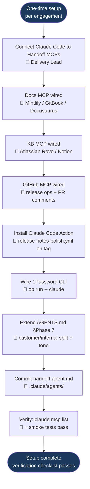

---

## End-to-End Phase Flow — Overview

High-level flow across Step 0 → Final Debrief. Each step box below maps to a per-step **Detail** diagram further down this page. Gate 1–6 names match [QUALITY-GATES.md](./QUALITY-GATES.md); a "No" at any gate loops back to the start of that step (shown in the detail diagrams). A Gate 4 failure routes back to **Step 3 (Handoff Document)** — when the handoff execution fails it is the handoff package itself that needs to be rebuilt before re-attempting Steps 4–7.

```mermaid
flowchart LR
    START([Phase 7: Delivery & Handoff<br/>Input: Completed Phases 1-6]) --> S0

    S0[Step 0: One-Time Setup] --> S1
    S1[Step 1: Release Management]
    S2[Step 2: Documentation Finalisation]
    S3[Step 3: Handoff Document Generation]
    S4[Step 4: Knowledge Transfer Sessions]
    S5[Step 5: Credential & Access Handoff]
    S6[Step 6: Infrastructure Handoff]
    S7[Step 7: Knowledge Base Population]
    S8[Step 8: Post-Handoff Support Period]
    SF[Final: 90-Day Debrief]

    S1 --> GATE1{Gate 1:<br/>Release Automation<br/>Operational}
    GATE1 -- No --> S1
    GATE1 -- Yes --> S2

    S2 --> GATE2{Gate 2:<br/>Documentation<br/>Complete}
    GATE2 -- No --> S2
    GATE2 -- Yes --> S3

    S3 --> GATE3{Gate 3:<br/>Handoff Package<br/>Ready}
    GATE3 -- No --> S3
    GATE3 -- Yes --> S4

    S4 --> S5 --> S6 --> S7 --> GATE4{Gate 4:<br/>Handoff<br/>Execution}
    GATE4 -- No --> S3
    GATE4 -- Yes --> S8

    S8 --> GATE5{Gate 5:<br/>Support Period<br/>Closure}
    GATE5 -- No --> S8
    GATE5 -- Yes --> SF

    SF --> GATE6{Gate 6:<br/>90-Day Debrief<br/>Complete}
    GATE6 -- No --> SF
    GATE6 -- Yes --> END([🎉 Engagement Concluded<br/>Recipient owns the system + AI loop])

    click S0 "#step-0-one-time-setup"
    click S1 "#step-1-release-management--detail"
    click S2 "#step-2-documentation-finalisation--detail"
    click S3 "#step-3-handoff-document-generation--detail"
    click S4 "#step-4-knowledge-transfer-sessions--detail"
    click S5 "#step-5-credential--access-handoff--detail"
    click S6 "#step-6-infrastructure-handoff--detail"
    click S7 "#step-7-knowledge-base-population--detail"
    click S8 "#step-8-post-handoff-support-period--detail"
    click SF "#final-90-day-debrief--detail"

    style START fill:#1B3A5C,color:#fff
    style END fill:#1B3A5C,color:#fff
    style S0 fill:#eef2ff,stroke:#4338CA
    style S1 fill:#f0f7ff,stroke:#2E75B6
    style S2 fill:#f0f7ff,stroke:#2E75B6
    style S3 fill:#e8f4e8,stroke:#2E8B57
    style S4 fill:#e8f4e8,stroke:#2E8B57
    style S5 fill:#fff3e0,stroke:#E65100
    style S6 fill:#fff3e0,stroke:#E65100
    style S7 fill:#e8f4e8,stroke:#2E8B57
    style S8 fill:#fef3f2,stroke:#B91C1C
    style SF fill:#fef3f2,stroke:#B91C1C
```

---

## Step 1: Release Management — Detail

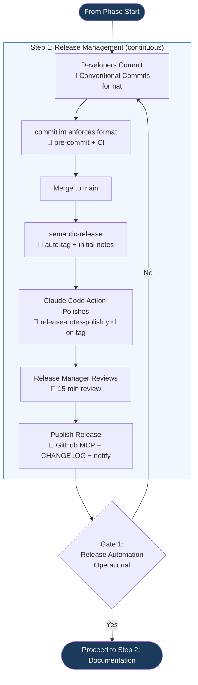

---

## Step 2: Documentation Finalisation — Detail

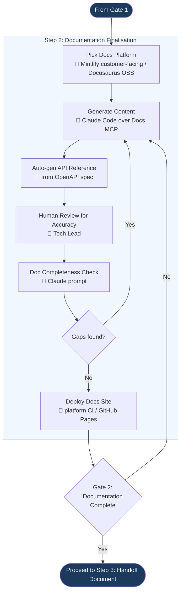

---

## Step 3: Handoff Document Generation — Detail

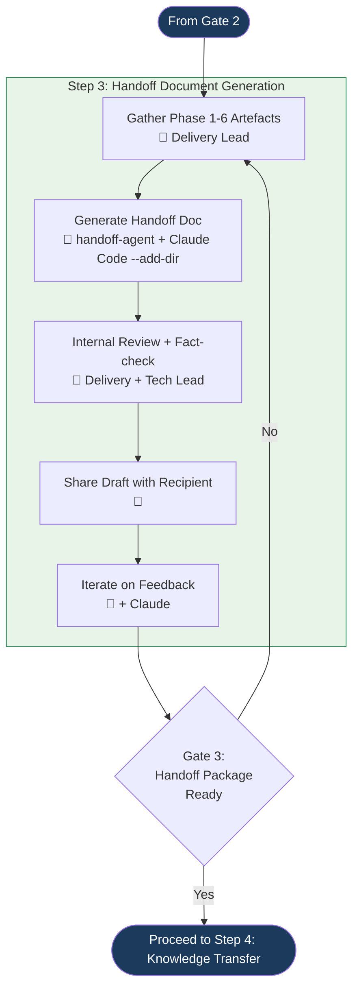

---

## Step 4: Knowledge Transfer Sessions — Detail

Steps 4 → 7 are jointly governed by **Gate 4 (Handoff Execution)**, which fires after Step 7. There is no per-step gate at the end of Step 4; if a Gate 4 failure later traces back to a KT-session defect, the team restarts at Step 3.

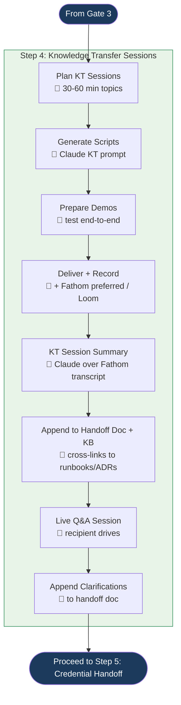

---

## Step 5: Credential & Access Handoff — Detail

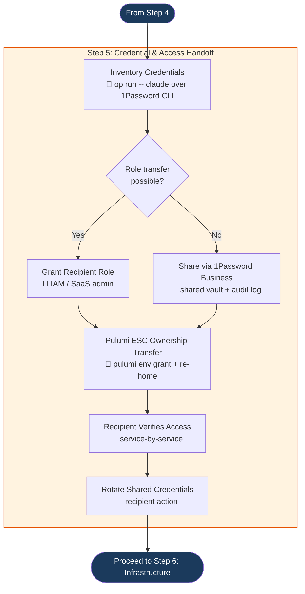

---

## Step 6: Infrastructure Handoff — Detail

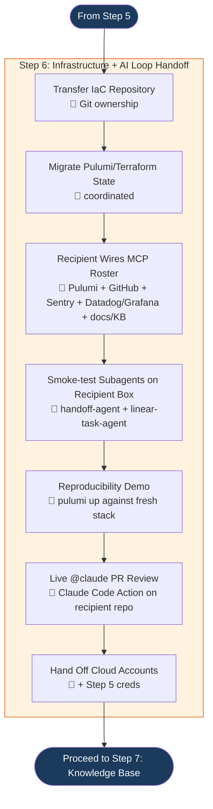

---

## Step 7: Knowledge Base Population — Detail

Gate 4 (Handoff Execution) fires after this step and validates Steps 4 → 7 collectively (KT delivered, credentials transferred, infrastructure operational, KB seeded). A **No** result restarts the team at Step 3 — when handoff execution fails, the handoff package itself needs to be rebuilt before re-running Steps 4–7.

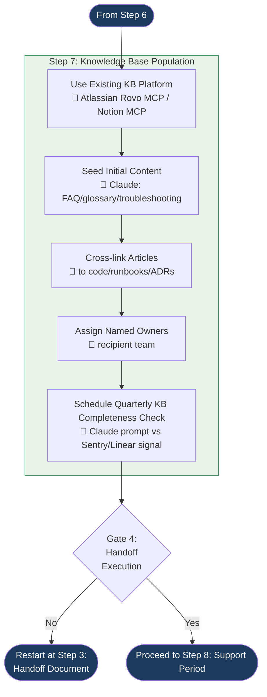

---

## Step 8: Post-Handoff Support Period — Detail

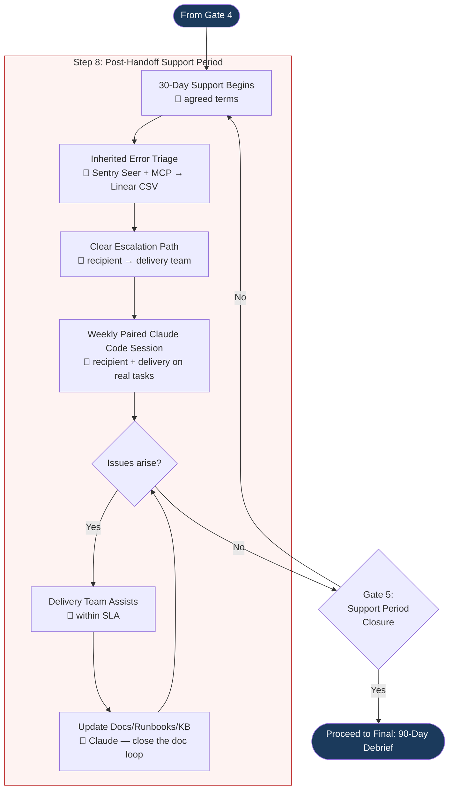

---

## Final: 90-Day Debrief — Detail

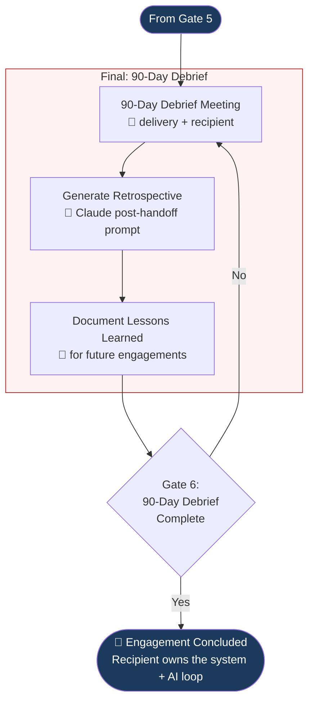

---

## Step-by-Step Anchors

The PROCESS.md links into these sections by anchor — keep the headings stable.

### Step 0: One-Time Setup
Wire Claude Code to the docs/KB/GitHub/1Password MCPs, install the Anthropic Claude Code Action, extend AGENTS.md with the Phase 7 customer/internal split, and commit `handoff-agent.md`. Setup completes when `claude mcp list` shows every server connected and smoke tests pass. See [PROCESS.md → Step 0](./PROCESS.md#step-0-one-time-setup--wire-ai-tools-into-the-handoff-loop).

### Step 1: Release Management
Conventional Commits + commitlint + semantic-release auto-tags releases; Anthropic Claude Code Action polishes the auto-generated notes; Release Manager reviews and publishes via GitHub MCP. See [PROCESS.md → Step 1](./PROCESS.md#step-1-release-management--auto-generated-release-notes).

### Step 2: Documentation Finalisation
Mintlify (customer-facing) or Docusaurus (OSS) over the Docs MCP; Claude generates content from OpenAPI + repo context; Tech Lead reviews; Claude completeness prompt blocks deploy on Critical gaps. See [PROCESS.md → Step 2](./PROCESS.md#step-2-documentation-finalisation).

### Step 3: Handoff Document Generation
`handoff-agent` runs Claude Code with `--add-dir` over Phase 1–6 artefacts; Delivery + Tech Lead fact-check; recipient draft-share + iteration. See [PROCESS.md → Step 3](./PROCESS.md#step-3-handoff-document-generation).

### Step 4: Knowledge Transfer Sessions
Claude generates KT scripts; sessions are Fathom-recorded; Claude auto-summarises transcripts and appends to the handoff doc + KB; live Q&A clarifications captured. See [PROCESS.md → Step 4](./PROCESS.md#step-4-knowledge-transfer-kt-sessions).

### Step 5: Credential & Access Handoff
1Password CLI (`op run -- claude`) inventories credentials without exposing plaintext; role-based transfer preferred over vault sharing; Pulumi ESC ownership re-homed; recipient verifies service-by-service and rotates shared creds. See [PROCESS.md → Step 5](./PROCESS.md#step-5-credential--access-handoff).

### Step 6: Infrastructure Handoff
IaC repo + state migration; recipient wires their MCP roster and smoke-tests the inherited subagents; live `pulumi up` reproducibility demo; first `@claude` PR review on the recipient repo. See [PROCESS.md → Step 6](./PROCESS.md#step-6-infrastructure-handoff).

### Step 7: Knowledge Base Population
Atlassian Rovo MCP or Notion MCP; Claude seeds FAQ/glossary/troubleshooting from the codebase + handoff doc; recipient assigns named owners; quarterly Claude-driven completeness check vs Sentry top issues + Linear closed bugs. See [PROCESS.md → Step 7](./PROCESS.md#step-7-knowledge-base-population).

### Step 8: Post-Handoff Support Period
30-day support begins; Sentry Seer + MCP triages the inherited error backlog into a Linear CSV; weekly paired Claude Code session; every issue closes a doc/runbook/KB gap. See [PROCESS.md → Step 8](./PROCESS.md#step-8-post-handoff-support-period).

### Final: 90-Day Debrief
Day-90 retrospective meeting between delivery + recipient; Claude generates the retro from support-period artefacts; lessons learned feed back into the AI-DLC framework owner. Documented inside [PROCESS.md → Step 8.8](./PROCESS.md#step-8-post-handoff-support-period).

---

## Key Decision Points

1. **Gate S — Setup verification (`claude mcp list`).** Step 0 is one-time per engagement. Until every required server is connected (docs, KB, GitHub, Sentry, Pulumi, Linear, 1Password, Anthropic Claude Code Action installed) and smoke tests pass, Phase 7 cannot start. Skipping Step 0 means paying the AI tax by hand on every release, every doc page, every credential transfer for the rest of the phase.
2. **Role transfer possible?** Always prefer IAM role transfer or SaaS admin-grant over credential sharing. Only share raw credentials when role-based access isn't available. Any shared credential must be rotated by the recipient after handoff. The 1Password CLI (`op run -- claude`) brokers vault access without exposing plaintext to Claude Code transcripts.
3. **Gaps found in completeness check?** Claude's Doc Completeness Check cross-references the codebase against the expected documentation list; the Quarterly KB Completeness Check diffs the live KB against Sentry top issues + Linear closed bugs. Gaps loop back to content generation before publishing.
4. **Issues in support period?** Delivery team assists within SLA during the support period. Every issue reveals a documentation or runbook gap — update accordingly so the next recipient doesn't hit the same issue. The Inherited Error Triage prompt bounds the support-period queue at the start so the recipient isn't drowned in 200 unprioritised Sentry issues.

---

## Timeline Overview

```
Pre-engagement (Step 0, one-time):
  Wire docs MCP (Mintlify/GitBook/Docusaurus) into Claude Code
  Wire KB MCP (Atlassian Rovo / Notion) into Claude Code
  Wire GitHub MCP + install Anthropic Claude Code Action
  Wire 1Password CLI for credential brokering
  Extend AGENTS.md with Phase 7 section (customer/internal split, tone, support defaults)
  Commit .claude/agents/handoff-agent.md
  Verify: claude mcp list shows every server connected

Week -2 before handoff:
  Generate handoff document (handoff-agent over Phase 1-6 artefacts via --add-dir)
  Record initial KT videos (Fathom preferred)
  Inventory credentials (op run -- claude over 1Password CLI)
  Verify IaC reproducibility internally

Week -1 before handoff:
  Share handoff document with recipient
  Schedule KT sessions
  Dry-run the infrastructure reproducibility demo

Handoff Week:
  Day 1: Pulumi Cloud workspace transfer + ESC re-home; recipient wires MCP roster on their machine; live reproducibility demo
  Day 2-4: Deliver KT sessions (Fathom-recorded; KT Session Summary auto-appended to handoff doc)
  Day 4: Credential transfer via 1Password Business shared vault; recipient verifies service-by-service
  Day 5: KB seeding via Atlassian/Notion MCP; agenda-less Q&A; support period scheduled

Day 1-30 (Support Period):
  Inherited Error Triage: Seer + Sentry MCP → Linear CSV import (bounds the queue)
  Weekly paired Claude Code session (recipient + delivery) on real tasks
  Every issue → docs/runbook/KB update by EOD via Claude Code
  Day-30: closure meeting + retrospective filed

Day 90:
  Final debrief with recipient
  Retrospective generated (Claude)
  Quarterly KB Completeness Check runs for the first time
  Lessons learned feed back into AI-DLC methodology
  Engagement concluded
```

## The AI-DLC Full Cycle Ends Here

With Phase 7 complete, the full AI-DLC has taken a project from idea (Phase 1: Requirement Gathering) through to long-term operational ownership by the recipient team — including the AI loop itself. The recipient inherits not just the code and infrastructure, but the wired MCP roster, the AGENTS.md context, the committed subagents, and the agentic CI hooks. The methodology is reusable — lessons from the 90-day debrief feed improvements back into the process for the next engagement.
